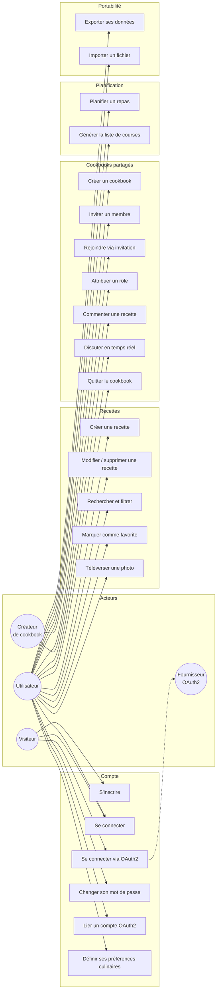
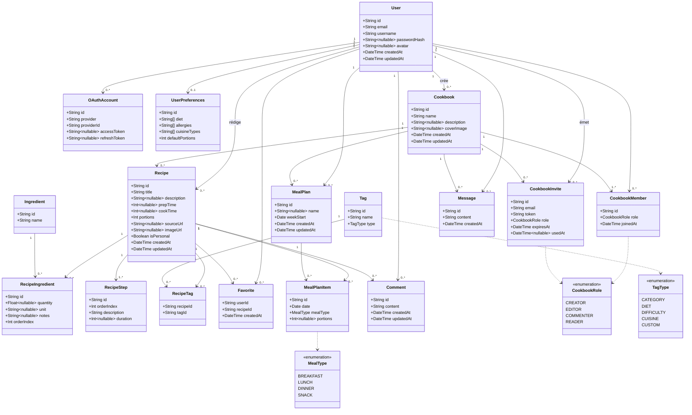
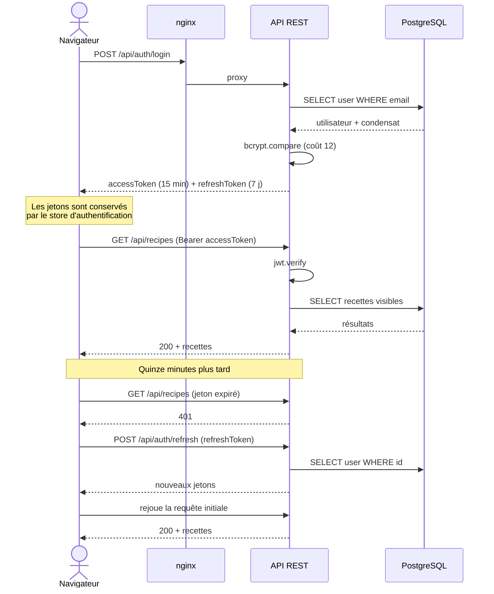
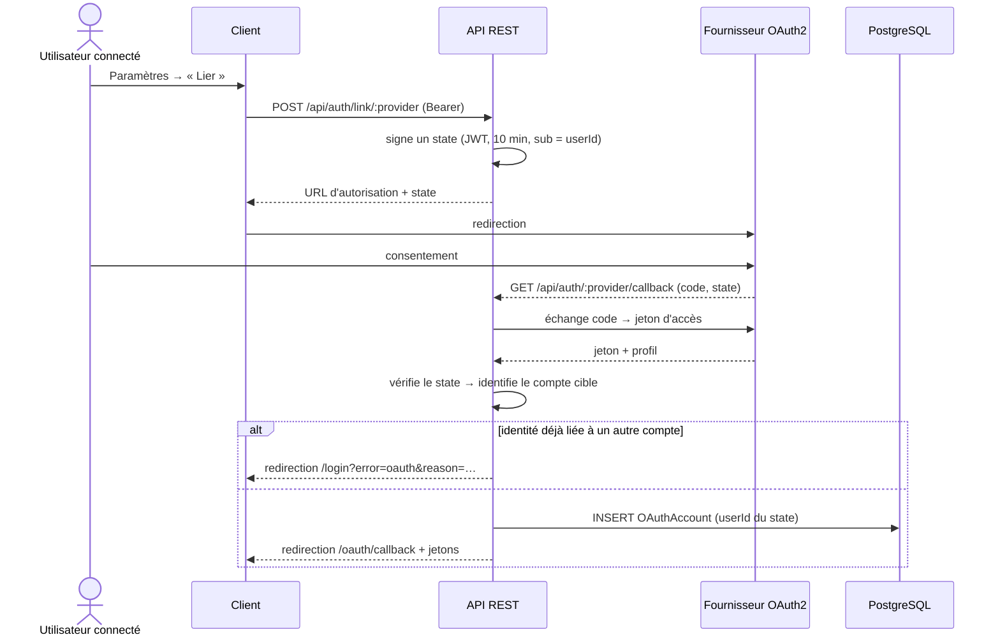
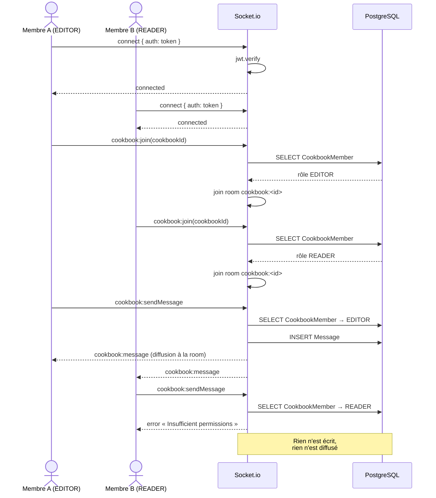
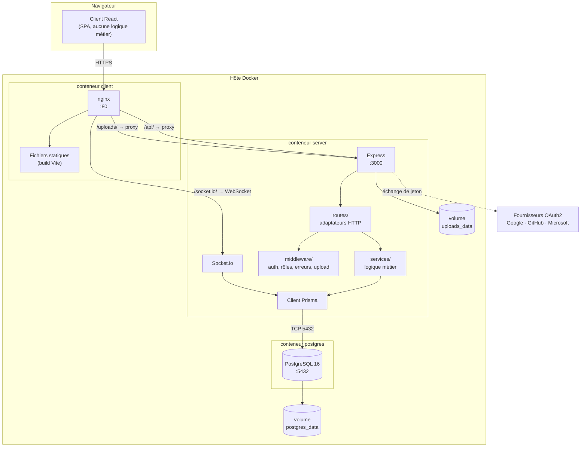
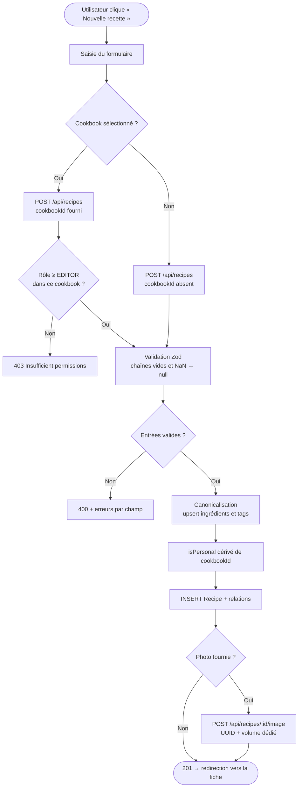

# Documentation Technique — SUPMEAL

> L'identité visuelle et les règles d'interface font l'objet d'un document distinct :
> [charte graphique](charte-graphique.md).

## 1. Prérequis et configuration

### Prérequis

| Outil | Version minimale | Usage |
|---|---|---|
| Docker Engine | 24.x | Déploiement conteneurisé |
| Docker Compose | v2 (`docker compose`) | Orchestration des 3 services |
| Node.js | 20.x | Développement local uniquement |
| npm | 10.x | Développement local uniquement |

### Variables d'environnement

Copier `.env.example` en `.env` à la racine du projet et renseigner :

| Variable | Requis | Description | Valeur par défaut / exemple |
|---|---|---|---|
| `POSTGRES_USER` | non | Utilisateur PostgreSQL | `supmeal` |
| `POSTGRES_PASSWORD` | **oui** | Mot de passe PostgreSQL — aucune valeur de repli | à générer |
| `POSTGRES_DB` | non | Nom de la base | `supmeal` |
| `JWT_SECRET` | **oui** | Secret de signature des access tokens | `openssl rand -base64 64` |
| `JWT_REFRESH_SECRET` | **oui** | Secret de signature des refresh tokens | `openssl rand -base64 64` |
| `PORT` | non | Port d'écoute de l'API dans le conteneur | `3000` |
| `NODE_ENV` | non | Environnement d'exécution | `production` |
| `CLIENT_URL` | non | Origine autorisée par CORS (URL publique du client) | `http://localhost:8080` |
| `VITE_API_URL` | non | Base de l'API vue du navigateur. **Laisser vide** en Docker : le client utilise alors des chemins relatifs (`/api`) servis par le reverse proxy nginx | *(vide)* |
| `OAUTH_CALLBACK_BASE` | non | Base publique des callbacks OAuth2 | `http://localhost:3000` |
| `GOOGLE_CLIENT_ID` / `GOOGLE_CLIENT_SECRET` | non | OAuth2 Google — stratégie désactivée si absent | — |
| `GITHUB_CLIENT_ID` / `GITHUB_CLIENT_SECRET` | non | OAuth2 GitHub — stratégie désactivée si absent | — |
| `MICROSOFT_CLIENT_ID` / `MICROSOFT_CLIENT_SECRET` | non | OAuth2 Microsoft — stratégie désactivée si absent | — |

> Les trois variables marquées « requis » n'ont volontairement **aucune valeur de repli** dans
> `docker-compose.yml`, afin qu'aucun secret par défaut ne puisse se retrouver en production.
> Elles doivent être renseignées avant le premier `docker compose up`.

> **⚠️ Sécurité** : ne jamais committer le fichier `.env`, ni l'inclure dans une archive de livraison.
> Il est exclu par `.gitignore`.

### Génération des secrets

```bash
openssl rand -base64 64   # JWT_SECRET
openssl rand -base64 64   # JWT_REFRESH_SECRET
openssl rand -base64 32   # POSTGRES_PASSWORD
```

---

## 2. Guide de déploiement

### Via Docker Compose (recommandé)

```bash
git clone <url-du-repo>
cd SUPMEAL
cp .env.example .env
# Éditer .env : renseigner POSTGRES_PASSWORD, JWT_SECRET, JWT_REFRESH_SECRET
docker compose up --build -d
```

Les 3 services démarrent dans l'ordre imposé par les directives `depends_on` / `healthcheck` :
`postgres` (attente de `pg_isready`) → `server` → `client`.

Le schéma de base de données est appliqué automatiquement au démarrage du serveur : la commande de
conteneur exécute `npx prisma db push --accept-data-loss` avant `node dist/server.js`
(voir `server/Dockerfile`).

### URLs d'accès

| Service | URL | Mapping de ports |
|---|---|---|
| Application web | http://localhost:8080 | `8080` (hôte) → `80` (nginx dans le conteneur) |
| API REST | http://localhost:3000/api | `3000` → `3000` |
| Health check | http://localhost:3000/api/health | — |
| PostgreSQL | `localhost:5432` | `5432` → `5432` |

Le navigateur n'appelle jamais `localhost:3000` directement : nginx (`client/nginx.conf`) relaie
`/api/`, `/uploads/` et `/socket.io/` (avec mise à niveau WebSocket) vers le service `server`.
L'API reste néanmoins exposée sur l'hôte pour le débogage et pour les callbacks OAuth2.

### Activation de l'authentification OAuth2 (optionnel)

L'application fonctionne sans aucun fournisseur OAuth2 : seule l'authentification par e-mail et mot
de passe est alors proposée. Chaque fournisseur est activé indépendamment en renseignant sa paire
identifiant/secret dans `.env`, puis en redémarrant le service `server`.

Le serveur expose les fournisseurs réellement configurés sur `GET /api/auth/providers`, et le client
n'affiche que les boutons correspondants. Un fournisseur non configuré répond `503` avec un message
explicite plutôt que d'échouer sur une stratégie Passport absente.

L'URL de rappel à déclarer chez chaque fournisseur est construite à partir de `OAUTH_CALLBACK_BASE` :

```
${OAUTH_CALLBACK_BASE}/api/auth/<provider>/callback
```

soit, en déploiement local par défaut :

| Fournisseur | URL de rappel à déclarer |
|---|---|
| Google | `http://localhost:3000/api/auth/google/callback` |
| GitHub | `http://localhost:3000/api/auth/github/callback` |
| Microsoft | `http://localhost:3000/api/auth/microsoft/callback` |

#### Google

1. Ouvrir [console.cloud.google.com](https://console.cloud.google.com/) → **APIs & Services** →
   **Credentials** → **Create credentials** → **OAuth client ID**
2. Type d'application : **Web application**
3. Ajouter l'URL de rappel ci-dessus dans **Authorized redirect URIs**
4. Reporter l'identifiant et le secret dans `GOOGLE_CLIENT_ID` et `GOOGLE_CLIENT_SECRET`

#### GitHub

1. Ouvrir [github.com/settings/developers](https://github.com/settings/developers) →
   **OAuth Apps** → **New OAuth App**
2. **Authorization callback URL** : l'URL de rappel ci-dessus
3. Générer un *client secret*, puis renseigner `GITHUB_CLIENT_ID` et `GITHUB_CLIENT_SECRET`

#### Microsoft

1. Ouvrir [portal.azure.com](https://portal.azure.com/) → **Microsoft Entra ID** →
   **App registrations** → **New registration**
2. **Redirect URI** : plateforme **Web**, avec l'URL de rappel ci-dessus
3. **Certificates & secrets** → **New client secret**
4. Renseigner `MICROSOFT_CLIENT_ID` et `MICROSOFT_CLIENT_SECRET`

#### Rattachement à un compte existant

Depuis **Paramètres → Comptes liés**, un utilisateur déjà connecté peut ajouter un fournisseur à son
compte. Le client demande d'abord une URL d'autorisation à `POST /api/auth/link/:provider` ; le
serveur y place un paramètre `state` signé (JWT de 10 minutes) qui identifie le compte courant, et le
callback rattache le fournisseur à **ce** compte plutôt que de se fier à l'adresse e-mail renvoyée.

Sans ce mécanisme, un fournisseur dont l'adresse e-mail diffère de celle du compte créerait un
second compte et la session basculerait dessus sans que l'utilisateur en soit averti.

Si l'identité du fournisseur est déjà rattachée à un autre compte SUPMEAL, la liaison est refusée.

---

### Captures d'écran du manuel utilisateur

Les illustrations du manuel sont générées en pilotant l'application, afin de rester régénérables
après une évolution de l'interface plutôt que reprises à la main :

```bash
docker compose up -d
docker compose exec server npm run db:seed
cd client && npm run captures
```

Le script `client/scripts/captures.mjs` s'appuie sur Playwright, garni la semaine de planning en
cours par l'API pour que les écrans ne soient pas vides, et écrit dans `docs/captures/`. Il est
idempotent : le relancer ne duplique pas les repas.

Les écrans de consentement de Google et de GitHub ne peuvent pas en faire partie : ils appartiennent
à ces fournisseurs et exigent un compte réel.

---

### Jeu de données de démonstration (optionnel)

Le seed n'est **pas** exécuté automatiquement par Docker. Pour peupler la base avec les tags par
défaut, des utilisateurs de démonstration, des cookbooks, des recettes et un planning :

```bash
docker compose exec server npm run db:seed
```

### Développement local

```bash
# 1. PostgreSQL via Docker uniquement
docker compose up postgres -d

# 2. Backend
cd server
npm install
# Créer server/.env avec au minimum :
#   DATABASE_URL=postgresql://<POSTGRES_USER>:<POSTGRES_PASSWORD>@localhost:5432/<POSTGRES_DB>
#   JWT_SECRET=<secret>
#   JWT_REFRESH_SECRET=<secret>
# Reprendre les valeurs du .env racine — ne jamais écrire de secret en dur dans la documentation.
npm run db:push    # applique le schéma Prisma
npm run db:seed    # jeu de données de démonstration
npm run dev        # API sur :3000

# 3. Frontend (autre terminal)
cd client
npm install
npm run dev        # :5173, proxy Vite vers :3000 pour /api, /uploads et /socket.io
```

### Arrêt et réinitialisation

```bash
docker compose down          # arrêt, volumes conservés
docker compose down -v       # arrêt + suppression des données (postgres_data, uploads_data)
```

---

## 3. Justification des choix technologiques

### Backend — Node.js + Express + TypeScript

- **Node.js 20** : runtime non bloquant adapté aux I/O concurrentes d'une API REST doublée d'un
  serveur WebSocket ; un seul langage sur l'ensemble de la stack.
- **Express 4** : framework minimaliste, chaîne de middlewares explicite, écosystème mature.
- **TypeScript** (`strict: true`) : typage statique, erreurs détectées à la compilation plutôt qu'à
  l'exécution.
- **Prisma ORM 5** : schéma déclaratif unique (`schema.prisma`), client typé généré automatiquement,
  requêtes type-safe. Le schéma est appliqué via `prisma db push` — synchronisation directe, sans
  historique de migrations versionnées ; choix assumé pour un projet dont la base est recréée à
  chaque déploiement.
- **Zod** : validation des entrées à la frontière HTTP, avec inférence des types TypeScript.
- **bcryptjs** : hachage des mots de passe, coût adaptatif de 12 tours.
- **jsonwebtoken** : authentification stateless (access token 15 min, refresh token 7 j).
- **Passport.js** (`passport-google-oauth20`, `passport-github2`, `passport-microsoft`) :
  implémentations OAuth2 standardisées ; chaque stratégie n'est enregistrée que si ses variables
  d'environnement sont présentes.
- **Socket.io 4** : WebSocket avec repli automatique en long-polling et gestion native des *rooms*,
  utilisées pour cloisonner la messagerie par cookbook.
- **Multer** : réception des uploads multipart (images de recettes), avec filtre sur l'extension et limite de taille (voir §6).
- **Helmet** : en-têtes HTTP de sécurité (CSP, HSTS, `X-Content-Type-Options`, anti-clickjacking).
- **express-rate-limit** : limitation de débit pour freiner le bruteforce sur l'authentification.
- **cors** : restriction des origines autorisées à `CLIENT_URL`.
- **compression** : compression gzip des réponses HTTP.
- **morgan** : journalisation des requêtes HTTP (activée hors développement).
- **uuid** : génération des noms de fichiers uploadés, pour éviter les collisions et ne jamais
  réutiliser le nom fourni par le client.
- **dotenv** : chargement du fichier `server/.env` en développement local (sans effet en conteneur,
  où les variables sont injectées par docker-compose).

### Frontend — React + TypeScript + Vite + Material UI

- **React 18** : modèle par composants, rendu concurrent.
- **TypeScript** : cohérence des types avec le contrat d'API du backend.
- **Vite 5** : serveur de développement à ESM natif (HMR quasi instantané) et build de production
  optimisé via Rollup.
- **Material UI v5** (`@mui/material`, `@mui/icons-material`, `@emotion/react`, `@emotion/styled`) :
  système de composants accessibles et thémables. C'est le système de style **principal** de
  l'application ; le thème est centralisé dans `client/src/theme.ts`.
- **TailwindCSS v4** (via `@tailwindcss/postcss`) : utilisé de manière **ciblée**, uniquement pour la
  section hero de la page d'accueil publique
  (`client/src/components/ui/glassmorphism-trust-hero.tsx`), dont les effets de *glassmorphism*
  étaient plus directs à exprimer en classes utilitaires. Les deux systèmes coexistent sans
  recouvrement : Tailwind n'est pas utilisé dans l'application authentifiée.
- **TanStack Query v5** : cache des données serveur, invalidation, états de chargement et d'erreur.
- **Zustand** : store d'authentification léger, sans le boilerplate de Redux.
- **React Router v6** : routage déclaratif et routes protégées (`client/src/App.tsx`).
- **React Hook Form** : formulaires non contrôlés, donc sans re-rendu à chaque frappe.
- **Axios** : client HTTP, avec intercepteurs pour l'injection du token et le rafraîchissement
  automatique sur `401` (`client/src/api/client.ts`).
- **Socket.io Client** : réception temps réel des messages de cookbook (`hooks/useSocket.ts`).
- **date-fns** : manipulation de dates immuable et *tree-shakeable* (planning hebdomadaire).
- **framer-motion** : animations d'entrée de la page d'accueil publique.
- **lucide-react** : jeu d'icônes de la page d'accueil publique ; l'application authentifiée utilise
  `@mui/icons-material`.
- **react-hot-toast** : notifications de retour utilisateur.

### Base de données — PostgreSQL 16

- SGBDR ACID, adapté au modèle fortement relationnel du domaine (recettes ↔ ingrédients ↔ tags ↔
  cookbooks ↔ membres).
- Types tableau natifs, utilisés pour `diet`, `allergies` et `cuisineTypes` dans `user_preferences`.
- Recherche insensible à la casse via le mode `insensitive` de Prisma (`ILIKE`).
- Index B-tree sur les colonnes de jointure et de filtrage (voir `schema.prisma`).

---

## 4. Diagrammes UML

Les diagrammes sont écrits en Mermaid : ils se rendent directement dans GitHub, GitLab et la plupart
des éditeurs Markdown, et restent versionnables au même titre que le code.

### 4.1 Diagramme de cas d'utilisation



Le **Créateur de cookbook** est une spécialisation de l'**Utilisateur** : il en possède tous les cas
d'utilisation, et seul lui peut gérer les membres. Les rôles `EDITOR`, `COMMENTER` et `READER`
restreignent progressivement l'accès (voir §4.5).

### 4.2 Diagramme de classes — modèle de données



`RecipeIngredient`, `RecipeTag` et `CookbookMember` sont des **classes-association** : elles portent
des attributs propres à la relation (quantité et unité pour un ingrédient, rôle pour un membre) et ne
peuvent donc pas être réduites à une simple table de jonction.

### 4.3 Diagramme de séquence — connexion et rafraîchissement de jeton



L'intercepteur HTTP du client sérialise les rafraîchissements : les requêtes concurrentes qui
échouent en `401` attendent le nouveau jeton au lieu de déclencher chacune sa propre rotation.

### 4.4 Diagramme de séquence — rattachement d'un fournisseur OAuth2



Le `state` est ce qui distingue un **rattachement** d'une **connexion** : sans lui, le callback ne
peut que rapprocher les comptes par adresse e-mail, et crée un second compte lorsqu'elles diffèrent.

### 4.5 Diagramme de séquence — messagerie temps réel et permissions



### 4.6 Diagramme de composants et de déploiement



Les trois briques du §2.3.1 correspondent aux trois conteneurs. Le navigateur ne joint jamais l'API
directement : nginx relaie `/api/`, `/uploads/` et `/socket.io/`, ce qui évite toute configuration
CORS côté client. Le port `3000` reste néanmoins publié pour les callbacks OAuth2 et le débogage.

### 4.7 Diagramme d'activité — création d'une recette



---
## 5. Schéma de la base de données

### 5.1 Modèle conceptuel (entités–associations)

Aucune directive `@@map` n'est utilisée dans `schema.prisma` : **les tables portent exactement le nom
des modèles Prisma**, en PascalCase, et doivent donc être citées entre guillemets en SQL
(`SELECT * FROM "Recipe"`).

```mermaid
erDiagram
    User ||--o{ OAuthAccount : "possède"
    User ||--o| UserPreferences : "paramètre"
    User ||--o{ Cookbook : "crée"
    User ||--o{ CookbookMember : "adhère"
    User ||--o{ CookbookInvite : "émet"
    User ||--o{ Recipe : "rédige"
    User ||--o{ Favorite : "marque"
    User ||--o{ MealPlan : "planifie"
    User ||--o{ Comment : "commente"
    User ||--o{ Message : "publie"

    Cookbook ||--|{ CookbookMember : "regroupe"
    Cookbook ||--o{ CookbookInvite : "propose"
    Cookbook ||--o{ Recipe : "contient"
    Cookbook ||--o{ Message : "héberge"
    Cookbook ||--o{ MealPlan : "partage"

    Recipe ||--|{ RecipeIngredient : "compose"
    Recipe ||--|{ RecipeStep : "détaille"
    Recipe ||--o{ RecipeTag : "classe"
    Recipe ||--o{ Favorite : "figure dans"
    Recipe ||--o{ Comment : "reçoit"
    Recipe ||--o{ MealPlanItem : "programme"

    Ingredient ||--o{ RecipeIngredient : "référencé par"
    Tag ||--o{ RecipeTag : "attribué par"
    MealPlan ||--o{ MealPlanItem : "contient"

    User {
        String id PK
        String email UK
        String username UK
        String passwordHash "nullable — absent si OAuth2 seul"
        String avatar "nullable"
        DateTime createdAt
        DateTime updatedAt
    }

    OAuthAccount {
        String id PK
        String userId FK
        String provider "google | github | microsoft"
        String providerId
        String accessToken "nullable"
        String refreshToken "nullable"
    }

    UserPreferences {
        String id PK
        String userId FK,UK
        String_array diet
        String_array allergies
        String_array cuisineTypes
        Int defaultPortions "défaut 4"
    }

    Cookbook {
        String id PK
        String name
        String description "nullable"
        String coverImage "nullable"
        String createdById FK
        DateTime createdAt
        DateTime updatedAt
    }

    CookbookMember {
        String id PK
        String cookbookId FK
        String userId FK
        CookbookRole role "CREATOR | EDITOR | COMMENTER | READER"
        DateTime joinedAt
    }

    CookbookInvite {
        String id PK
        String cookbookId FK
        String email "destinataire nominatif"
        String token UK
        CookbookRole role
        String invitedById FK
        DateTime expiresAt
        DateTime usedAt "nullable"
        DateTime createdAt
    }

    Recipe {
        String id PK
        String title
        String description "nullable"
        Int prepTime "nullable, minutes"
        Int cookTime "nullable, minutes"
        Int portions "défaut 4"
        String sourceUrl "nullable"
        String imageUrl "nullable"
        Boolean isPersonal "dérivé de cookbookId"
        String createdById FK
        String cookbookId FK "nullable"
        DateTime createdAt
        DateTime updatedAt
    }

    Ingredient {
        String id PK
        String name UK "forme canonique, minuscules"
    }

    RecipeIngredient {
        String id PK
        String recipeId FK
        String ingredientId FK
        Float quantity "nullable"
        String unit "nullable"
        String notes "nullable"
        Int orderIndex
    }

    RecipeStep {
        String id PK
        String recipeId FK
        Int orderIndex
        String description
        Int duration "nullable, minutes"
    }

    Tag {
        String id PK
        String name UK "forme canonique"
        TagType type "CATEGORY | DIET | DIFFICULTY | CUISINE | CUSTOM"
    }

    RecipeTag {
        String recipeId PK,FK
        String tagId PK,FK
    }

    Favorite {
        String userId PK,FK
        String recipeId PK,FK
        DateTime createdAt
    }

    MealPlan {
        String id PK
        String userId FK
        String cookbookId FK "nullable"
        String name "nullable"
        Date weekStart "lundi de la semaine"
        DateTime createdAt
        DateTime updatedAt
    }

    MealPlanItem {
        String id PK
        String mealPlanId FK
        String recipeId FK
        Date date
        MealType mealType "BREAKFAST | LUNCH | DINNER | SNACK"
        Int portions "nullable — surcharge les portions de la recette"
    }

    Comment {
        String id PK
        String recipeId FK
        String userId FK
        String content
        DateTime createdAt
        DateTime updatedAt
    }

    Message {
        String id PK
        String cookbookId FK
        String userId FK
        String content
        DateTime createdAt
    }
```



### 5.2 Cardinalités et règles structurantes

| Association | Cardinalité | Justification |
|---|---|---|
| `Cookbook` → `CookbookMember` | 1 → 1..N | Un cookbook a toujours au moins son créateur ; celui-ci ne peut pas le quitter. |
| `Recipe` → `RecipeIngredient` | 1 → 1..N | Le schéma de validation impose au moins un ingrédient. |
| `Recipe` → `RecipeStep` | 1 → 1..N | Idem pour les étapes. |
| `Recipe` → `Cookbook` | 0..1 | Une recette sans cookbook est personnelle (`isPersonal = true`). |
| `User` → `UserPreferences` | 1 → 0..1 | Créées à l'inscription, absentes pour les comptes anciens. |
| `Ingredient` / `Tag` | catalogues partagés | Un même ingrédient est référencé par toutes les recettes qui l'emploient, ce qui rend le filtrage par ingrédient exact. |

### 5.3 Clés et contraintes d'unicité

| Table | Contrainte | Effet |
|---|---|---|
| `User` | `email` unique, `username` unique | Un compte par adresse ; nom d'utilisateur non ambigu. |
| `OAuthAccount` | `(provider, providerId)` unique | Une identité de fournisseur ne peut être rattachée qu'à un seul compte. |
| `CookbookMember` | `(cookbookId, userId)` unique | Une adhésion unique par personne et par cookbook. |
| `CookbookInvite` | `token` unique | Le jeton identifie l'invitation. |
| `Ingredient`, `Tag` | `name` unique | Impose la forme canonique. |
| `RecipeTag` | clé primaire `(recipeId, tagId)` | Un tag ne peut être posé deux fois. |
| `Favorite` | clé primaire `(userId, recipeId)` | Un favori est un fait, pas un compteur. |

### 5.4 Suppressions en cascade

| Suppression de | Entraîne |
|---|---|
| `User` | comptes OAuth, préférences, adhésions, favoris, plannings, commentaires, messages |
| `Cookbook` | adhésions, invitations, **recettes du cookbook**, messages |
| `Recipe` | ingrédients, étapes, tags, favoris, commentaires, **entrées de planning** |
| `MealPlan` | ses entrées |

La cascade `Recipe` → `MealPlanItem` est indispensable : sans elle, supprimer une recette déjà
planifiée violait la contrainte de clé étrangère et échouait en erreur 500.

### 5.5 Index

Les index déclarés dans `schema.prisma` couvrent les colonnes de jointure et de tri
(`Recipe.createdById`, `Recipe.cookbookId`, `Recipe.title`, `Message.createdAt`, `MealPlan.weekStart`,
`MealPlanItem.date`, etc.).

La recherche plein texte demande davantage : un `LIKE '%terme%'` ne peut exploiter aucun index
B-tree. `server/src/config/searchIndex.ts` complète donc le schéma au démarrage, en DDL idempotente :

| Objet | Rôle |
|---|---|
| extension `unaccent` | retire les diacritiques |
| extension `pg_trgm` | index de trigrammes, seuls capables de servir un `LIKE` avec joker en tête |
| fonction `supmeal_normalize(text)` | `lower(unaccent(...))`, déclarée `IMMUTABLE` pour être indexable |
| index GIN | `Recipe.title`, `Recipe.description`, `RecipeStep.description`, `Ingredient.name`, `Tag.name` |

Ces objets sortent du périmètre de `prisma db push`, qui ne sait déclarer ni extension ni index
fonctionnel. Si les extensions ne peuvent pas être créées — base managée sans droits
superutilisateur — le serveur émet un avertissement et la recherche retombe sur `ILIKE`, sensible
aux accents et non indexée, sans que l'application cesse de fonctionner.

---
## 6. Sécurité

### Authentification

| Élément | Mise en œuvre | Référence |
|---|---|---|
| Hachage des mots de passe | bcrypt, coût 12 (adaptatif) | `server/src/routes/auth.ts:39` |
| Access token | JWT signé `HS256`, durée de vie 15 min | `server/src/middleware/auth.ts:61` |
| Refresh token | JWT signé avec un secret distinct, durée de vie 7 j | `server/src/middleware/auth.ts:64` |
| Rafraîchissement | Intercepteur Axios sur `401`, avec file d'attente des requêtes concurrentes | `client/src/api/client.ts` |
| OAuth2 | Google, GitHub, Microsoft via Passport ; stratégie enregistrée uniquement si ses variables d'environnement sont définies | `server/src/config/passport.ts` |

Le mot de passe n'est jamais stocké ni journalisé en clair : seul le condensat bcrypt est persisté
dans la colonne `users.passwordHash`, qui est nullable pour les comptes créés uniquement via OAuth2.

### Protections applicatives

- **Rate limiting** — 20 requêtes / 15 min sur les routes `/api/auth`, 500 requêtes / 15 min sur le
  reste de l'API. `app.set('trust proxy', 1)` est indispensable : sans lui, `req.ip` vaut l'adresse
  de nginx et tous les visiteurs sont comptés dans un seul seau, si bien qu'un utilisateur actif
  bloque l'authentification de tous les autres. Un seul saut est déclaré, nginx étant le seul
  intermédiaire.
- **Validation** — toutes les entrées des routes mutantes sont validées côté serveur avec Zod.
- **CORS** — origine restreinte à la valeur de `CLIENT_URL`.
- **Helmet** — en-têtes de sécurité HTTP : CSP, HSTS, `X-Content-Type-Options: nosniff`,
  `X-Frame-Options`, `Referrer-Policy`. La politique `crossOriginResourcePolicy` est assouplie en
  `cross-origin` pour permettre le service des images de recettes.
  *Helmet ne fournit pas de protection CSRF* ; celle-ci n'est pas nécessaire ici car
  l'authentification repose sur un en-tête `Authorization: Bearer` et non sur un cookie de session.
- **Taille des corps de requête** — limitée à 10 Mo (JSON et `urlencoded`).
- **Permissions** — système de rôles hiérarchique appliqué côté serveur
  (`CREATOR` > `EDITOR` > `COMMENTER` > `READER`), voir `server/src/middleware/permissions.ts`.

### Uploads de fichiers

- Taille limitée à **5 Mo** par fichier (`server/src/middleware/upload.ts`).
- Nom de fichier régénéré côté serveur avec un UUID v4 : le nom fourni par le client n'est jamais
  réutilisé, ce qui neutralise les tentatives de *path traversal*.
- Extensions autorisées : `.jpg`, `.jpeg`, `.png`, `.webp`, `.gif`.

> **Limite connue** : le filtre d'upload contrôle uniquement l'**extension** du fichier, et non son
> type MIME réel ni sa signature binaire. Un fichier arbitraire renommé en `.png` serait donc
> accepté. Le risque reste contenu (les fichiers sont servis en statique depuis un volume dédié,
> jamais interprétés côté serveur), mais un contrôle du `mimetype` Multer et de la signature du
> fichier constituerait un durcissement pertinent.

### Secrets

- Aucun secret n'est présent dans le code source ni dans le dépôt : `docker-compose.yml` lit
  exclusivement des variables d'environnement, et `POSTGRES_PASSWORD`, `JWT_SECRET` et
  `JWT_REFRESH_SECRET` n'ont volontairement aucune valeur de repli.
- Les variables d'environnement sont validées au démarrage par `server/src/config/env.ts` (schéma
  Zod). En l'absence d'un secret requis, le serveur **refuse de démarrer** avec un message explicite,
  plutôt que de retomber sur une valeur codée en dur qui serait publiquement connue et rendrait tous
  les jetons forgeables. Un avertissement est également émis si les secrets sont restés aux valeurs
  d'exemple.
- `.env` est exclu par `.gitignore` ; seul `.env.example`, qui ne contient que des valeurs
  d'exemple à remplacer, est versionné.
## 7. Référence de l'API REST

Toutes les routes sont préfixées par `/api`. Sauf mention contraire, elles exigent un en-tête
`Authorization: Bearer <accessToken>`.

### 7.1 Conventions

**Réponse en cas de succès**

```json
{ "success": true, "data": { } }
```

**Réponse en cas d'erreur**

```json
{ "success": false, "message": "Validation error", "errors": { "title": ["Required"] } }
```

**Codes employés**

| Code | Signification |
|---|---|
| `200` | Succès |
| `201` | Ressource créée |
| `400` | Entrée invalide — `errors` détaille les champs fautifs |
| `401` | Jeton absent, invalide ou expiré |
| `403` | Authentifié mais droits insuffisants |
| `404` | Ressource inexistante ou hors du périmètre visible |
| `409` | Conflit — unicité violée, ou ressource encore référencée |
| `503` | Fournisseur OAuth2 non configuré sur ce déploiement |

**Limitation de débit** — 20 requêtes / 15 min sur `/api/auth`, 500 requêtes / 15 min ailleurs.

**Pagination** — les listes paginées renvoient
`{ items, total, page, limit, totalPages }`. `limit` est plafonné à 50.

### 7.2 Authentification — `/api/auth`

| Méthode | Chemin | Auth | Description |
|---|---|:---:|---|
| `POST` | `/register` | — | Inscription. Corps : `email`, `username` (3–30, alphanumérique), `password` (≥ 8). Renvoie l'utilisateur et les deux jetons. |
| `POST` | `/login` | — | Connexion. Corps : `email`, `password`. |
| `POST` | `/refresh` | — | Échange un `refreshToken` contre une nouvelle paire de jetons. |
| `GET` | `/providers` | — | Fournisseurs OAuth2 réellement configurés : `{ providers: ["google", "github"] }`. |
| `POST` | `/link/:provider` | ✔ | Prépare le rattachement d'un fournisseur au compte courant. Renvoie une URL d'autorisation portant un `state` signé (10 min). |
| `GET` | `/google` · `/github` · `/microsoft` | — | Démarre le flux OAuth2. `503` si le fournisseur n'est pas configuré. |
| `GET` | `/google/callback` · `/github/callback` · `/microsoft/callback` | — | Retour du fournisseur. Redirige vers `CLIENT_URL/oauth/callback` avec les jetons, ou vers `/login?error=oauth&reason=…` en cas d'échec. |

### 7.3 Compte utilisateur — `/api/users`

| Méthode | Chemin | Description |
|---|---|---|
| `GET` | `/me` | Profil, préférences et fournisseurs liés. |
| `GET` | `/me/stats` | Compteurs du tableau de bord : `recipes`, `cookbooks`, `favorites`, `plannedThisWeek`. |
| `PATCH` | `/me` | Modifie `username` et/ou `avatar`. `409` si le nom est déjà pris. |
| `POST` | `/me/change-password` | Corps : `currentPassword`, `newPassword` (≥ 8). `400` pour un compte sans mot de passe (OAuth2 seul). |
| `PATCH` | `/me/preferences` | `diet[]`, `allergies[]`, `cuisineTypes[]`, `defaultPortions`. |

**Effet des préférences.** `defaultPortions` s'applique à toute recette créée sans nombre de
portions explicite, et le formulaire pré-remplit le champ. `allergies` est confronté aux ingrédients
sur `GET /api/recipes/:id`, qui renvoie `allergyWarnings[]` : la correspondance se fait par inclusion
sur les formes canoniques, si bien que « arachide » alerte sur « beurre d'arachide ». C'est un
avertissement affiché, jamais un blocage. `diet` et `cuisineTypes` restent déclaratifs.
| `DELETE` | `/me/oauth/:provider` | Dissocie un fournisseur. `400` si c'est le dernier moyen de connexion. |

### 7.4 Recettes — `/api/recipes`

| Méthode | Chemin | Description |
|---|---|---|
| `GET` | `/` | Recherche et filtrage. Paramètres ci-dessous. |
| `POST` | `/` | Création. Au moins un ingrédient et une étape. `isPersonal` est **dérivé** de `cookbookId` et refusé s'il est fourni. |
| `GET` | `/:id` | Détail, avec `isFavorite`, `comments` et `permissions.canEdit` / `canDelete`. |
| `PUT` | `/:id` | Modification. Ingrédients, étapes et tags sont **remplacés en bloc**. |
| `DELETE` | `/:id` | Suppression. Entraîne ses entrées de planning. |
| `POST` | `/:id/image` | Téléversement `multipart/form-data`, champ `image`. Extensions autorisées, 5 Mo maximum. |
| `POST` | `/:id/favorite` | Marque comme favorite. |
| `DELETE` | `/:id/favorite` | Retire des favoris. |
| `GET` | `/suggestions` | Suggestions classées pour un créneau (§9). Paramètres : `date?`, `mealType?`, `limit?` (≤ 10). |
| `GET` | `/:id/comments` | Commentaires. Réservé aux personnes ayant accès à la recette. |
| `POST` | `/:id/comments` | Ajoute un commentaire (≤ 2000 caractères). Refusé au rôle `READER`. |
| `DELETE` | `/:recipeId/comments/:commentId` | Supprime son propre commentaire. |

**Paramètres de `GET /api/recipes`**

| Paramètre | Type | Effet |
|---|---|---|
| `q` | texte | Recherche plein texte sur titre, description, **étapes**, ingrédients et tags. Insensible à la casse **et aux accents**. |
| `cookbookId` | id | Restreint à un cookbook — c'est la barre de recherche propre au cookbook (§2.2.2). |
| `tags` | liste séparée par virgules | Recettes portant l'un des tags. |
| `ingredients` | liste séparée par virgules | Correspondance partielle, insensible à la casse. |
| `maxPrepTime` | entier | `prepTime ≤ valeur`. |
| `maxCookTime` | entier | `cookTime ≤ valeur`. |
| `favorites` | `true` | Favoris de l'appelant uniquement. |
| `page`, `limit` | entiers | Pagination ; `limit` ≤ 50. |

Les critères se combinent en conjonction. Le filtre de visibilité est appliqué séparément et ne peut
être ni écrasé ni contourné : une recette personnelle n'appartient qu'à son auteur, une recette de
cookbook n'est visible que par les membres de ce cookbook.

### 7.5 Cookbooks — `/api/cookbooks`

| Méthode | Chemin | Rôle requis | Description |
|---|---|:---:|---|
| `GET` | `/` | — | Cookbooks de l'utilisateur, chacun avec `myRole` et `permissions`. |
| `POST` | `/` | — | Création ; l'auteur devient `CREATOR`. |
| `GET` | `/:id` | `READER` | Détail avec la liste des membres. |
| `PATCH` | `/:id` | `EDITOR` | Modifie nom et description. |
| `POST` | `/:id/cover` | `EDITOR` | Image de couverture (`multipart`, champ `image`). |
| `DELETE` | `/:id` | `CREATOR` | Supprime le cookbook **et ses recettes**. |
| `POST` | `/:id/invite` | `CREATOR` | Invitation nominative. Corps : `email`, `role`. Renvoie un `token` valable 7 jours. |
| `POST` | `/join/:token` | — | Accepte une invitation. `403` si l'adresse du compte ne correspond pas à celle invitée. |
| `PATCH` | `/:id/members/:userId` | `CREATOR` | Change le rôle. Le rôle `CREATOR` n'est pas attribuable. |
| `DELETE` | `/:id/members/:userId` | `CREATOR` | Retire un membre. |
| `DELETE` | `/:id/leave` | — | Quitter. Refusé au créateur. |
| `GET` | `/:cookbookId/messages` | `READER` | Historique du chat. `limit` ≤ 100, `before` pour paginer. |

**Droits par rôle** (renvoyés dans `permissions`)

| | `CREATOR` | `EDITOR` | `COMMENTER` | `READER` |
|---|:---:|:---:|:---:|:---:|
| Consulter les recettes | ✔ | ✔ | ✔ | ✔ |
| Lire le chat | ✔ | ✔ | ✔ | ✔ |
| Commenter / écrire dans le chat | ✔ | ✔ | ✔ | — |
| Créer et modifier des recettes | ✔ | ✔ | — | — |
| Gérer les membres et invitations | ✔ | — | — | — |
| Supprimer le cookbook | ✔ | — | — | — |

### 7.6 Catalogues — `/api/tags`

| Méthode | Chemin | Description |
|---|---|---|
| `GET` | `/` | Tags, filtrables par `type`. |
| `POST` | `/` | Crée ou réutilise un tag. Corps : `name`, `type`. |
| `GET` | `/ingredients` | Autocomplétion. `q` pour filtrer, `limit` ≤ 50. |

### 7.7 Planification — `/api/meal-plans`

| Méthode | Chemin | Description |
|---|---|---|
| `GET` | `/` | Plannings de l'utilisateur. |
| `GET` | `/week?offset=N` | Semaine relative (`0` courante, `-1` précédente). Renvoie `weekStart`, `weekEnd`, les 7 `days`, `today`, un `defaultName` et le `plan` s'il existe. |
| `POST` | `/schedule` | Planifie une recette à une date : le serveur résout la semaine et crée le planning au besoin. Corps : `recipeId`, `date`, `mealType`, `portions?`, `planName?`. |
| `POST` | `/` | Crée un planning. Corps : `weekStart` (`YYYY-MM-DD`), `name?`, `cookbookId?`. Rattacher un cookbook exige d'y être `CREATOR` ou `EDITOR`. |
| `GET` | `/:id` | Détail d'un planning. |
| `DELETE` | `/:id` | Supprime un planning et ses entrées. |
| `POST` | `/:id/items` | Ajoute une entrée à un planning existant. |
| `DELETE` | `/:id/items/:itemId` | Retire une entrée. La suppression est cantonnée au planning indiqué. |
| `GET` | `/:id/shopping-list` | Liste de courses agrégée : `[{ name, totalQuantity, unit, notes[] }]`. |

**Plannings partagés.** Un planning dont `cookbookId` est renseigné appartient au cookbook et non à
son seul auteur : tous ses membres le voient et le retrouvent sur `GET /week`. Les rôles s'appliquent
comme pour les recettes — `CREATOR` et `EDITOR` remanient le planning, `COMMENTER` et `READER` le
consultent. C'est la forme que prend « planifier des repas ensemble » du §2.1. Un planning sans
`cookbookId` reste strictement personnel.

Lorsque plusieurs plannings couvrent la même semaine, `GET /week` privilégie le planning personnel :
un planning de groupe ne doit pas masquer celui que l'on tient pour soi.

L'agrégation regroupe par couple (ingrédient, unité), l'unité étant normalisée pour la comparaison —
`g` et `G` fusionnent. Aucune conversion entre unités différentes n'est tentée : 200 g et 0,2 kg
restent deux lignes.

### 7.8 Portabilité — `/api/export` et `/api/import`

| Méthode | Chemin | Description |
|---|---|---|
| `GET` | `/api/export?format=json` | Export complet et réimportable : recettes personnelles, celles créées dans les cookbooks de tiers dont on est encore membre, et cookbooks créés avec leurs recettes. |
| `GET` | `/api/export?format=csv` | Tableur. Format à plat, donc partiellement lossy. |
| `GET` | `/api/export?format=mealie` | Liste de recettes au vocabulaire schema.org, importable dans Mealie. Les cookbooks sont aplatis, Mealie n'ayant pas de notion équivalente. |
| `POST` | `/api/import` | `multipart/form-data`, champ `file`. 10 Mo maximum. Renvoie `{ recipes, cookbooks, errors[] }`. |

L'import reconnaît seul le format : JSON SUPMEAL, CSV, ou export Mealie / schema.org. L'utilisateur
devient `CREATOR` des cookbooks importés. Chaque cookbook est importé dans une transaction — il
arrive complet ou pas du tout — tandis que les erreurs sont rapportées élément par élément afin qu'un
fichier partiellement valide reste exploitable. Limites : 2000 recettes, 200 cookbooks par fichier.

### 7.9 Messagerie temps réel — Socket.io

Point de montage `/socket.io/`, relayé par nginx avec mise à niveau WebSocket.

**Connexion**

```js
io('http://localhost:8080', { auth: { token: accessToken } });
```

Le jeton est vérifié au *handshake* ; une connexion sans jeton valide est refusée.

| Sens | Événement | Charge utile | Description |
|---|---|---|---|
| → | `cookbook:join` | `cookbookId` | Rejoint le salon. Refusé si l'on n'est pas membre. |
| → | `cookbook:leave` | `cookbookId` | Quitte le salon. |
| → | `cookbook:sendMessage` | `{ cookbookId, content }` | Publie un message. Refusé au rôle `READER`. |
| ← | `cookbook:message` | `{ id, cookbookId, userId, username, avatar, content, createdAt }` | Diffusé à tout le salon, expéditeur compris. |
| ← | `cookbook:joined` / `cookbook:left` | `{ userId, username }` | Arrivée ou départ d'un membre. |
| ← | `error` | `string` | Motif du refus. |

### 7.10 Divers

| Méthode | Chemin | Auth | Description |
|---|---|:---:|---|
| `GET` | `/api/health` | — | Sonde de vivacité : `{ success, status, timestamp }`. |
| `GET` | `/uploads/recipes/:file` | — | Image de recette. Servie en statique, relayée par nginx. |

---

---

## 8. Constitution du rendu

### Archive

```bash
node scripts/package-rendu.mjs
```

Produit `dist-rendu/SUPMEAL.zip` à partir de `git archive` : l'archive ne contient donc **que les
fichiers suivis par Git**, et tout ce que `.gitignore` écarte en est absent par construction —
`.env` et ses secrets, `node_modules`, les artefacts de build, les images téléversées, les dossiers
d'outillage local.

Avant d'écrire l'archive, le script :

1. refuse de s'exécuter si des modifications ne sont pas committées, l'archive ne refléterait pas le dépôt ;
2. vérifie que `.env`, `node_modules`, les sorties de build et les uploads ne sont pas suivis ;
3. inspecte chaque fichier texte suivi à la recherche d'identifiants Google, de secrets Google,
   d'identifiants et secrets OAuth GitHub, de clés privées, de jetons GitHub et de clés API Google.
   `.env.example` est exempté : ses valeurs sont des exemples par construction.

> **Ne pas compresser le dossier de travail à la main.** `.env` y contient les secrets OAuth réels,
> ce que le sujet sanctionne d'un malus proportionnel à la criticité du secret exposé.

### Dépôt Git

Le dépôt doit être **privé pendant la réalisation** et **passé en public au moment du rendu** sur
Moodle.

```bash
git remote add origin https://github.com/<compte>/SUPMEAL.git
git push -u origin main
```

## 9. Suggestions intelligentes de recettes

Fonctionnalité avancée du barème bonus. `GET /api/recipes/suggestions` propose des recettes pour un
créneau donné du planning.

### 9.1 Ce que le moteur n'est pas

Ce n'est ni un tri par popularité, ni un tirage aléatoire, ni un appel à un service externe. Le
classement se fait entièrement sur les données de l'application, sans dépendance réseau ni modèle
pré-entraîné, et chaque suggestion est accompagnée de sa justification.

### 9.2 Architecture

| Fichier | Rôle |
|---|---|
| `services/suggestionEngine.ts` | Classement. **Fonctions pures**, aucun accès aux données. |
| `services/suggestionService.ts` | Rassemble les signaux en base, traduit, délègue. |
| `tests/suggestionEngine.test.ts` | 26 cas unitaires, sans base de données. |

La séparation est ce qui rend le moteur testable : le classement reçoit des objets simples et rend un
résultat déterministe, si bien que chaque comportement attendu peut être vérifié isolément.

### 9.3 Représentation vectorielle

Une recette est projetée dans un espace de termes formé de ses **ingrédients** et de ses **tags**,
chaque terme pondéré par sa fréquence inverse de document :

```
idf(t) = ln(1 + N / (1 + df(t)))
```

Cette pondération est le cœur du dispositif. Dans un corpus de cuisine, « sel » et « poivre »
figurent dans presque toutes les recettes et ne disent rien de la parenté entre deux plats, tandis
que « jaunes d'œuf » ou « safran » sont très discriminants. Sur le jeu de démonstration, « poivre
noir » apparaît dans 5 recettes sur 7 et « jaunes d'œuf » dans 2 : sans IDF, toute similarité serait
dominée par les condiments.

Le **profil de goût** est le barycentre pondéré des recettes que l'utilisateur a favorisées ou
planifiées :

- un favori pèse **3**, un repas simplement planifié **1** — le premier est un geste délibéré ;
- l'historique décroît exponentiellement, de **demi-vie 6 semaines**, sur une profondeur de 26
  semaines. Sans cette décroissance, un profil se figerait sur les premiers choix.

L'**affinité** est la similarité cosinus entre ce profil et le vecteur de la recette, tous deux
normalisés — donc dans `[0, 1]`.

### 9.4 Les six signaux

| Signal | Poids | Ce qu'il mesure |
|---|:---:|---|
| **Goût** | 0,34 | Similarité cosinus au profil, pondérée IDF |
| **Économie de courses** | 0,20 | Part des ingrédients déjà requis par la semaine |
| **Adéquation horaire** | 0,15 | Durée totale face au budget du créneau |
| **Préférences** | 0,14 | Correspondance cuisine et régime déclarés |
| **Renouvellement** | 0,12 | Ancienneté de la dernière planification |
| **Popularité** | 0,05 | Favoris et commentaires, compressés en log |

Les poids somment à 1, ce qui borne le score dans `[0, 1]` et le rend comparable d'une requête à
l'autre.

Le goût domine parce que c'est le seul signal réellement personnel. L'économie de courses vient
ensuite : dans un outil de planification, réutiliser un ingrédient déjà nécessaire a une valeur
concrète. La popularité ne pèse presque rien — elle ne sert qu'à départager un utilisateur nouveau
dont tous les autres signaux sont muets.

**Budgets de temps**, en minutes, appliqués à `prepTime + cookTime` :

| Créneau | Semaine | Week-end |
|---|:---:|:---:|
| Petit-déjeuner | 15 | 40 |
| Déjeuner | 30 | 75 |
| Dîner | 50 | 120 |
| Encas | 15 | 30 |

Sous le budget, l'adéquation vaut 1 ; au-delà elle décroît en `budget / durée` plutôt que de tomber à
zéro — une recette dix minutes trop longue reste envisageable, pas une de trois heures. Une durée non
renseignée vaut 0,5 : ni favorisée, ni pénalisée.

### 9.5 Filtres

| Règle | Nature |
|---|---|
| Allergène déclaré présent dans les ingrédients | **Exclusion absolue** |
| Recette déjà au planning de la semaine visée | Forte préférence, assouplissable |

La correspondance des allergènes se fait par **inclusion** sur les formes canoniques : « arachide »
écarte « beurre d'arachide », qu'une égalité stricte laisserait passer.

La distinction entre les deux règles est délibérée. Un allergène relève de la sécurité et n'admet
aucun assouplissement. Répéter un plat dans la semaine, en revanche, est légitime : si **toutes** les
recettes éligibles sont déjà planifiées, le moteur les réintroduit en les marquant `alreadyInWeek` et
en signalant `basis.relaxed`. Renvoyer une liste vide sans motif serait moins utile qu'un ensemble de
répétitions annoncées comme telles.

### 9.6 Diversification

La sélection finale n'est pas « les N meilleurs ». Les scores les plus élevés se ressemblent souvent
beaucoup, et proposer cinq variantes du même plat n'aide personne. Une **pertinence marginale
maximale** retire, à chaque tour, le candidat qui maximise :

```
(1 − λ) · score − λ · max(similarité avec les candidats déjà retenus)      λ = 0,3
```

### 9.7 Justifications

Chaque suggestion porte au plus trois motifs, ordonnés par **contribution réelle au score**
(`poids × signal`) et non par valeur brute du signal. Un signal en dessous de 0,25 n'est pas invoqué.

Les formulations sont fidèles au calcul : le motif horaire annonce « compatible avec ce créneau »
uniquement lorsque l'adéquation vaut 1, et « un peu long pour ce créneau » sinon. Le même plat de
75 minutes est donc décrit comme trop long un mardi et compatible un dimanche — deux verdicts
opposés, tous deux exacts.

Une suggestion inexpliquée ne se distingue pas d'un tirage au hasard : la justification n'est pas un
ornement, c'est ce qui rend la fonctionnalité utilisable.

### 9.8 Interprétabilité de la réponse

`basis` expose ce sur quoi le classement s'est appuyé : taille du corpus, nombre de favoris,
profondeur d'historique, ingrédients déjà prévus, allergies déclarées, et si les contraintes ont été
desserrées. Le champ `breakdown` de chaque suggestion donne les six signaux séparément, ce qui permet
de comprendre un classement sans lire le code.

### 9.9 Coût et limites

Le classement est linéaire en taille de corpus, mais IDF et diversification imposent de tout charger
en mémoire : le corpus est donc **plafonné à 500 recettes**. Au-delà, il faudrait précalculer et
stocker les vecteurs.

Limites assumées :

- **Démarrage à froid** — sans favori ni historique, l'affinité est nulle et le classement repose sur
  le temps, les préférences déclarées et la popularité. C'est le rôle de ce dernier signal.
- **Aucune saisonnalité** — les recettes ne portent pas d'information de saison.
- **Aucun filtrage collaboratif** — pas de « les utilisateurs qui aiment X aiment aussi Y ». Le
  volume de données d'un déploiement de cette taille ne le permettrait pas de façon fiable.
- **Le régime n'est pas une contrainte dure** — un tag `vegan` déclaré en préférence favorise les
  recettes correspondantes sans exclure les autres, contrairement aux allergies.

---
