# Documentation Technique — SUPMEAL

> L'identité visuelle et les règles d'interface font l'objet d'un document distinct :
> [charte graphique](charte-graphique.md).

## 1. Prérequis et configuration

### Prérequis

| Outil | Version minimale | Usage |
|---|---|---|
| Docker Engine | 24.x | Déploiement conteneurisé |
| Docker Compose | v2 (`docker compose`) | Orchestration des 3 services |
| Node.js | 20.x | Développement local uniquement |
| npm | 10.x | Développement local uniquement |

### Variables d'environnement

Copier `.env.example` en `.env` à la racine du projet et renseigner :

| Variable | Requis | Description | Valeur par défaut / exemple |
|---|---|---|---|
| `POSTGRES_USER` | non | Utilisateur PostgreSQL | `supmeal` |
| `POSTGRES_PASSWORD` | **oui** | Mot de passe PostgreSQL — aucune valeur de repli | à générer |
| `POSTGRES_DB` | non | Nom de la base | `supmeal` |
| `JWT_SECRET` | **oui** | Secret de signature des access tokens | `openssl rand -base64 64` |
| `JWT_REFRESH_SECRET` | **oui** | Secret de signature des refresh tokens | `openssl rand -base64 64` |
| `PORT` | non | Port d'écoute de l'API dans le conteneur | `3000` |
| `NODE_ENV` | non | Environnement d'exécution | `production` |
| `CLIENT_URL` | non | Origine autorisée par CORS (URL publique du client) | `http://localhost:8080` |
| `VITE_API_URL` | non | Base de l'API vue du navigateur. **Laisser vide** en Docker : le client utilise alors des chemins relatifs (`/api`) servis par le reverse proxy nginx | *(vide)* |
| `OAUTH_CALLBACK_BASE` | non | Base publique des callbacks OAuth2 | `http://localhost:3000` |
| `GOOGLE_CLIENT_ID` / `GOOGLE_CLIENT_SECRET` | non | OAuth2 Google — stratégie désactivée si absent | — |
| `GITHUB_CLIENT_ID` / `GITHUB_CLIENT_SECRET` | non | OAuth2 GitHub — stratégie désactivée si absent | — |
| `MICROSOFT_CLIENT_ID` / `MICROSOFT_CLIENT_SECRET` | non | OAuth2 Microsoft — stratégie désactivée si absent | — |

> Les trois variables marquées « requis » n'ont volontairement **aucune valeur de repli** dans
> `docker-compose.yml`, afin qu'aucun secret par défaut ne puisse se retrouver en production.
> Elles doivent être renseignées avant le premier `docker compose up`.

> **⚠️ Sécurité** : ne jamais committer le fichier `.env`, ni l'inclure dans une archive de livraison.
> Il est exclu par `.gitignore`.

### Génération des secrets

```bash
openssl rand -base64 64   # JWT_SECRET
openssl rand -base64 64   # JWT_REFRESH_SECRET
openssl rand -base64 32   # POSTGRES_PASSWORD
```

---

## 2. Guide de déploiement

> Ce chapitre décrit **ce qu'est** le déploiement : services, ordonnancement, variables, ports.
> Pour les procédures — diagnostic d'une panne, sauvegarde, mise en ligne sur un serveur — voir
> le [guide d'exploitation](guide-exploitation.md), qui ne répète pas ce chapitre mais le
> prolonge.

### Via Docker Compose (recommandé)

```bash
git clone <url-du-repo>
cd SUPMEAL
cp .env.example .env
# Éditer .env : renseigner POSTGRES_PASSWORD, JWT_SECRET, JWT_REFRESH_SECRET
docker compose up --build -d
```

**`docker compose up` suffit sur un dépôt fraîchement cloné.** Aucune étape préalable : les trois
valeurs sensibles — `POSTGRES_PASSWORD`, `JWT_SECRET`, `JWT_REFRESH_SECRET` — ont une valeur de
repli dans `docker-compose.yml`, préfixée `change_me`. La pile démarre et fonctionne.

Le serveur ne s'en cache pas. Au démarrage :

```
⚠️  Valeurs de démonstration en place pour les secrets JWT et le mot de passe PostgreSQL.
   La pile fonctionne, mais ces valeurs sont publiques : elles figurent dans .env.example et
   dans docker-compose.yml. Avant tout déploiement réel, renseignez .env avec des secrets
   générés : openssl rand -base64 64
```

Ces replis **ne sont pas des secrets** : ce sont des marqueurs, de même nature que ceux de
`.env.example`. Un secret est une valeur dont la confidentialité protège quelque chose ; une
chaîne publiée dans un dépôt public et annoncée comme provisoire ne protège rien et ne prétend
pas le faire. Le serveur les détecte par leur marqueur (`PLACEHOLDER_MARKERS`) plutôt que par
comparaison à une liste de chaînes exactes, qui dériverait au premier renommage.

La hiérarchie est celle de Compose : une variable présente dans `.env` **prend le pas** sur le
repli. Un déploiement réel n'a donc rien à modifier dans `docker-compose.yml` — il renseigne
`.env`, et les valeurs de démonstration disparaissent avec l’avertissement.

Ce compromis a été tranché dans ce sens parce que le cahier des charges exige que l'application
se lance « intégralement via docker compose et soit fonctionnelle ». Exiger un `cp` préalable
faisait échouer cette commande sur un clone neuf, ce qui pèse plus lourd que la présence de
marqueurs publics dans le fichier.

Les 3 services démarrent dans l'ordre imposé par les directives `depends_on` / `healthcheck` :
`postgres` (attente de `pg_isready`) → `server` → `client`.

Le schéma de base de données est appliqué automatiquement au démarrage du serveur : la commande de
conteneur exécute `npx prisma db push --accept-data-loss` avant `node dist/server.js`
(voir `server/Dockerfile`).

### URLs d'accès

| Service | URL | Mapping de ports | Variable |
|---|---|---|---|
| Application web | http://localhost:8080 | `8080` (hôte) → `80` (nginx dans le conteneur) | `CLIENT_PORT` |
| API REST | http://localhost:3000/api | `3000` → `3000` | `SERVER_PORT` |
| Health check | http://localhost:3000/api/health | — | — |
| PostgreSQL | `localhost:5432` | `5432` → `5432` | `POSTGRES_PORT` |

**Les trois ports hôte sont redéfinissables.** Si l’un est déjà occupé — un autre PostgreSQL sur
`5432` est le cas le plus courant — il suffit de le déplacer dans `.env` sans toucher au fichier
Compose :

```bash
echo "POSTGRES_PORT=5433" >> .env
docker compose up -d
```

Les ports **internes** ne changent jamais : les services se joignent par leur nom sur le réseau
Docker (`postgres:5432`, `server:3000`), indépendamment de ce qui est publié sur l’hôte. Déplacer
`CLIENT_PORT` ou `SERVER_PORT` demande en revanche d’aligner `CLIENT_URL` et
`OAUTH_CALLBACK_BASE`, qui sont des URL vues du navigateur.

Le navigateur n'appelle jamais `localhost:3000` directement : nginx (`client/nginx.conf`) relaie
`/api/`, `/uploads/` et `/socket.io/` (avec mise à niveau WebSocket) vers le service `server`.
L'API reste néanmoins exposée sur l'hôte pour le débogage et pour les callbacks OAuth2.

### Activation de l'authentification OAuth2 (optionnel)

L'application fonctionne sans aucun fournisseur OAuth2 : seule l'authentification par e-mail et mot
de passe est alors proposée. Chaque fournisseur est activé indépendamment en renseignant sa paire
identifiant/secret dans `.env`, puis en redémarrant le service `server`.

Le serveur expose les fournisseurs réellement configurés sur `GET /api/auth/providers`, et le client
n'affiche que les boutons correspondants. Un fournisseur non configuré répond `503` avec un message
explicite plutôt que d'échouer sur une stratégie Passport absente.

L'URL de rappel à déclarer chez chaque fournisseur est construite à partir de `OAUTH_CALLBACK_BASE` :

```
${OAUTH_CALLBACK_BASE}/api/auth/<provider>/callback
```

soit, en déploiement local par défaut :

| Fournisseur | URL de rappel à déclarer |
|---|---|
| Google | `http://localhost:3000/api/auth/google/callback` |
| GitHub | `http://localhost:3000/api/auth/github/callback` |
| Microsoft | `http://localhost:3000/api/auth/microsoft/callback` |

#### Google

1. Ouvrir [console.cloud.google.com](https://console.cloud.google.com/) → **APIs & Services** →
   **Credentials** → **Create credentials** → **OAuth client ID**
2. Type d'application : **Web application**
3. Ajouter l'URL de rappel ci-dessus dans **Authorized redirect URIs**
4. Reporter l'identifiant et le secret dans `GOOGLE_CLIENT_ID` et `GOOGLE_CLIENT_SECRET`

#### GitHub

1. Ouvrir [github.com/settings/developers](https://github.com/settings/developers) →
   **OAuth Apps** → **New OAuth App**
2. **Authorization callback URL** : l'URL de rappel ci-dessus
3. Générer un *client secret*, puis renseigner `GITHUB_CLIENT_ID` et `GITHUB_CLIENT_SECRET`

#### Microsoft

1. Ouvrir [portal.azure.com](https://portal.azure.com/) → **Microsoft Entra ID** →
   **App registrations** → **New registration**
2. **Redirect URI** : plateforme **Web**, avec l'URL de rappel ci-dessus
3. **Certificates & secrets** → **New client secret**
4. Renseigner `MICROSOFT_CLIENT_ID` et `MICROSOFT_CLIENT_SECRET`

#### Rattachement à un compte existant

Depuis **Paramètres → Comptes liés**, un utilisateur déjà connecté peut ajouter un fournisseur à son
compte. Le client demande d'abord une URL d'autorisation à `POST /api/auth/link/:provider` ; le
serveur y place un paramètre `state` signé (JWT de 10 minutes) qui identifie le compte courant, et le
callback rattache le fournisseur à **ce** compte plutôt que de se fier à l'adresse e-mail renvoyée.

Sans ce mécanisme, un fournisseur dont l'adresse e-mail diffère de celle du compte créerait un
second compte et la session basculerait dessus sans que l'utilisateur en soit averti.

Si l'identité du fournisseur est déjà rattachée à un autre compte SUPMEAL, la liaison est refusée.

---

### Captures d'écran du manuel utilisateur

Les illustrations du manuel sont générées en pilotant l'application, afin de rester régénérables
après une évolution de l'interface plutôt que reprises à la main :

```bash
docker compose up -d
docker compose exec server npm run db:seed
cd client && npm run captures
```

Le script `client/scripts/captures.mjs` s'appuie sur Playwright, garni la semaine de planning en
cours par l'API pour que les écrans ne soient pas vides, et écrit dans `docs/captures/`. Il est
idempotent : le relancer ne duplique pas les repas.

Les écrans de consentement de Google et de GitHub ne peuvent pas en faire partie : ils appartiennent
à ces fournisseurs et exigent un compte réel.

---

### Jeu de données de démonstration (optionnel)

Le seed n'est **pas** exécuté automatiquement par Docker. Pour peupler la base avec les tags par
défaut, des utilisateurs de démonstration, des cookbooks, des recettes et un planning :

```bash
docker compose exec server npm run db:seed
```

### Développement local

```bash
# 1. PostgreSQL via Docker uniquement
docker compose up postgres -d

# 2. Backend
cd server
npm install
# Créer server/.env avec au minimum :
#   DATABASE_URL=postgresql://<POSTGRES_USER>:<POSTGRES_PASSWORD>@localhost:5432/<POSTGRES_DB>
#   JWT_SECRET=<secret>
#   JWT_REFRESH_SECRET=<secret>
# Reprendre les valeurs du .env racine — ne jamais écrire de secret en dur dans la documentation.
npm run db:push    # applique le schéma Prisma
npm run db:seed    # jeu de données de démonstration
npm run dev        # API sur :3000

# 3. Frontend (autre terminal)
cd client
npm install
npm run dev        # :5173, proxy Vite vers :3000 pour /api, /uploads et /socket.io
```

### Arrêt et réinitialisation

```bash
docker compose down          # arrêt, volumes conservés
docker compose down -v       # arrêt + suppression des données (postgres_data, uploads_data)
```

### Noms de conteneurs et instances parallèles

Aucun `container_name` n’est imposé : Compose dérive les noms du nom de projet, lui-même dérivé
du répertoire — `supmeal-postgres-1`, `supmeal-server-1`, `supmeal-client-1`. Deux conséquences
utiles.

La pile **cohabite** avec n’importe quel autre conteneur, y compris un homonyme : un nom fixe
aurait provoqué un `Conflict. The container name "/supmeal_db" is already in use`, et le
lancement aurait échoué sans que la cause soit évidente.

Et **deux instances tournent en parallèle**, à condition de leur donner un nom de projet et des
ports distincts :

```bash
CLIENT_PORT=8081 SERVER_PORT=3001 POSTGRES_PORT=5433 docker compose -p supmeal2 up -d
```

Chaque projet reçoit son propre réseau et ses propres volumes (`supmeal2_postgres_data`), donc
ses propres données. `docker compose -p supmeal2 down -v` ne démonte que celle-là — le nom de
projet est ce qui borne la portée de la commande, et c’est la raison de préférer
`docker compose down` à un `docker stop` global.

---

## 3. Justification des choix technologiques

### Backend — Node.js + Express + TypeScript

- **Node.js 20** : runtime non bloquant adapté aux I/O concurrentes d'une API REST doublée d'un
  serveur WebSocket ; un seul langage sur l'ensemble de la stack.
- **Express 4** : framework minimaliste, chaîne de middlewares explicite, écosystème mature.
- **TypeScript** (`strict: true`) : typage statique, erreurs détectées à la compilation plutôt qu'à
  l'exécution.
- **Prisma ORM 5** : schéma déclaratif unique (`schema.prisma`), client typé généré automatiquement,
  requêtes type-safe. Le schéma est appliqué via `prisma db push` — synchronisation directe, sans
  historique de migrations versionnées ; choix assumé pour un projet dont la base est recréée à
  chaque déploiement.
- **Zod** : validation des entrées à la frontière HTTP, avec inférence des types TypeScript.
- **bcryptjs** : hachage des mots de passe, coût adaptatif de 12 tours.
- **jsonwebtoken** : authentification stateless (access token 15 min, refresh token 7 j).
- **Passport.js** (`passport-google-oauth20`, `passport-github2`, `passport-microsoft`) :
  implémentations OAuth2 standardisées ; chaque stratégie n'est enregistrée que si ses variables
  d'environnement sont présentes.
- **Socket.io 4** : WebSocket avec repli automatique en long-polling et gestion native des *rooms*,
  utilisées pour cloisonner la messagerie par cookbook.
- **Multer** : réception des uploads multipart (images de recettes), avec filtre sur l'extension et limite de taille (voir §6).
- **Helmet** : en-têtes HTTP de sécurité (CSP, HSTS, `X-Content-Type-Options`, anti-clickjacking).
- **express-rate-limit** : limitation de débit pour freiner le bruteforce sur l'authentification.
- **cors** : restriction des origines autorisées à `CLIENT_URL`.
- **compression** : compression gzip des réponses HTTP.
- **morgan** : journalisation des requêtes HTTP (activée hors développement).
- **uuid** : génération des noms de fichiers uploadés, pour éviter les collisions et ne jamais
  réutiliser le nom fourni par le client.
- **dotenv** : chargement du fichier `server/.env` en développement local (sans effet en conteneur,
  où les variables sont injectées par docker-compose).

### Frontend — React + TypeScript + Vite + Material UI

- **React 18** : modèle par composants, rendu concurrent.
- **TypeScript** : cohérence des types avec le contrat d'API du backend.
- **Vite 5** : serveur de développement à ESM natif (HMR quasi instantané) et build de production
  optimisé via Rollup.
- **Material UI v5** (`@mui/material`, `@mui/icons-material`, `@emotion/react`, `@emotion/styled`) :
  système de composants accessibles et thémables. C'est le système de style **principal** de
  l'application ; le thème est centralisé dans `client/src/theme.ts`.
- **TailwindCSS v4** (via `@tailwindcss/postcss`) : utilisé de manière **ciblée**, uniquement pour la
  section hero de la page d'accueil publique
  (`client/src/components/ui/glassmorphism-trust-hero.tsx`), dont les effets de *glassmorphism*
  étaient plus directs à exprimer en classes utilitaires. Les deux systèmes coexistent sans
  recouvrement : Tailwind n'est pas utilisé dans l'application authentifiée.
- **TanStack Query v5** : cache des données serveur, invalidation, états de chargement et d'erreur.
- **Zustand** : store d'authentification léger, sans le boilerplate de Redux.
- **React Router v6** : routage déclaratif et routes protégées (`client/src/App.tsx`).
- **React Hook Form** : formulaires non contrôlés, donc sans re-rendu à chaque frappe.
- **Axios** : client HTTP, avec intercepteurs pour l'injection du token et le rafraîchissement
  automatique sur `401` (`client/src/api/client.ts`).
- **Socket.io Client** : réception temps réel des messages de cookbook (`hooks/useSocket.ts`).
- **date-fns** : manipulation de dates immuable et *tree-shakeable* (planning hebdomadaire).
- **framer-motion** : animations d'entrée de la page d'accueil publique.
- **lucide-react** : jeu d'icônes de la page d'accueil publique ; l'application authentifiée utilise
  `@mui/icons-material`.
- **react-hot-toast** : notifications de retour utilisateur.

### Base de données — PostgreSQL 16

- SGBDR ACID, adapté au modèle fortement relationnel du domaine (recettes ↔ ingrédients ↔ tags ↔
  cookbooks ↔ membres).
- Types tableau natifs, utilisés pour `diet`, `allergies` et `cuisineTypes` dans `user_preferences`.
- Recherche insensible à la casse via le mode `insensitive` de Prisma (`ILIKE`).
- Index B-tree sur les colonnes de jointure et de filtrage (voir `schema.prisma`).

---

## 4. Diagrammes UML

Les diagrammes sont écrits en Mermaid : ils se rendent directement dans GitHub, GitLab et la plupart
des éditeurs Markdown, et restent versionnables au même titre que le code.

### 4.1 Diagrammes de cas d'utilisation

Trente-et-un cas d'utilisation dans un seul graphe donnaient un ruban illisible : les arêtes de
l'acteur générique traversaient tous les paquets. Le modèle est donc découpé par **paquet
fonctionnel**, chaque diagramme ne portant que les acteurs qui le concernent. La numérotation
UC1–UC31 est continue d'un diagramme à l'autre et sert de référence dans le reste du document.

#### Acteurs et hiérarchie des rôles

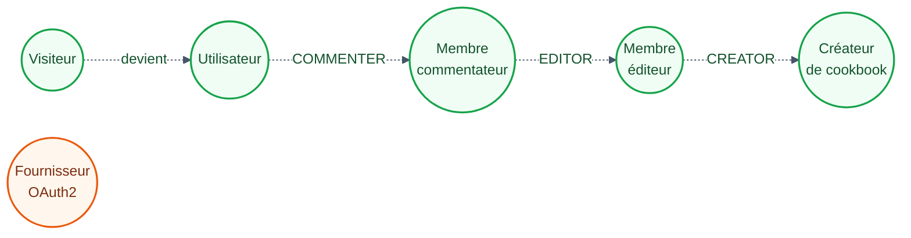

Chaque rôle **hérite** du précédent : un `EDITOR` peut tout ce que peut un `COMMENTER`. Un membre
simplement adhérent est un `READER` — il lit, mais ne commente pas. Le `Fournisseur OAuth2` est un
acteur **externe** : il n'utilise pas le système, il participe à deux de ses cas d'utilisation.

Le rôle `CREATOR` naît avec le cookbook et ne s'attribue pas : il n'existe aucun transfert de
propriété, et la seule sortie du créateur est de supprimer le cookbook (UC25).

#### Compte

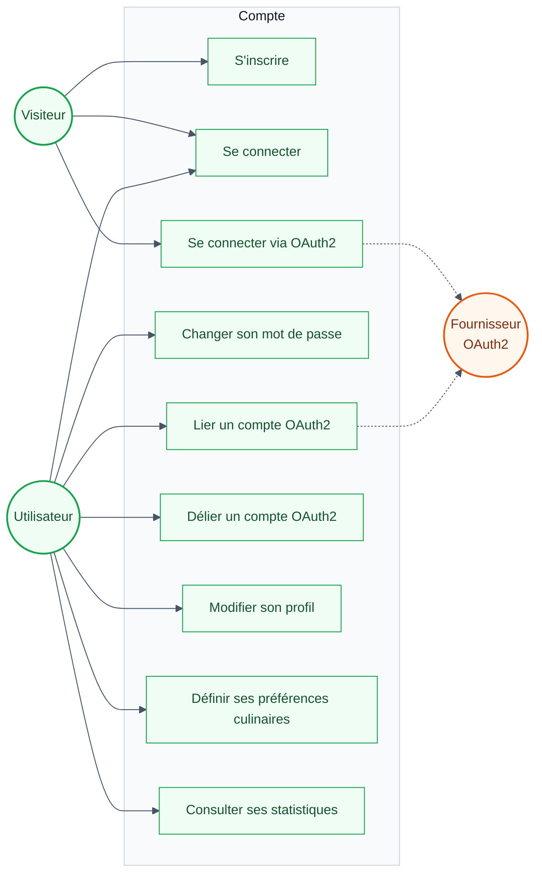

Le **Visiteur** ne dispose que des trois portes d'entrée. Tout le reste suppose une session. Les
deux liens en pointillé marquent les cas où un **acteur externe** intervient : le fournisseur
OAuth2 est sollicité aussi bien pour la connexion (UC3) que pour le rattachement d'une identité à
un compte existant (UC5).

#### Recettes

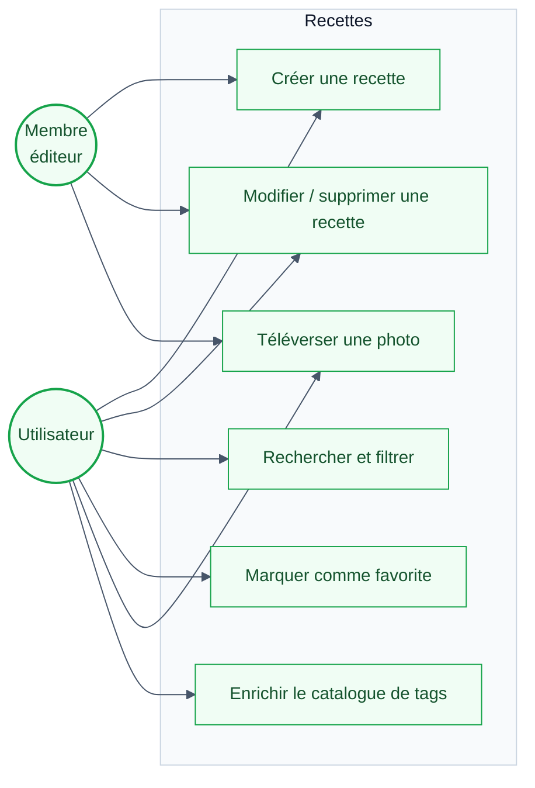

**UC10, UC11 et UC14** dépendent de la recette visée, pas seulement de l’acteur. Sur une recette
**personnelle**, tout utilisateur agit sans condition — c’est l’arc partant de l’utilisateur
générique. Dès qu’une recette porte un `cookbookId`, l’écriture relève de `WRITE_ROLES` —
`CREATOR` ou `EDITOR` — d’où le second arc, partant de l’éditeur.

Un `COMMENTER` ne peut donc pas modifier une recette du cookbook, **même celle qu’il a lui-même
rédigée** : l’appartenance prime sur la paternité (§7.4).
#### Cookbooks partagés

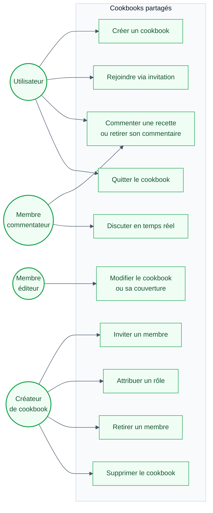

**UC18** suit la même règle que les recettes : commenter sa **propre** recette personnelle ne demande
aucun rôle — d'où l'arc partant de l'utilisateur générique. Le seuil `COMMENTER` ne s'applique qu'aux
recettes rattachées à un cookbook. Retirer un commentaire est réservé à son auteur.

**UC20** n'est pas offert au créateur, qui ne peut pas quitter son cookbook.

#### Planification et portabilité

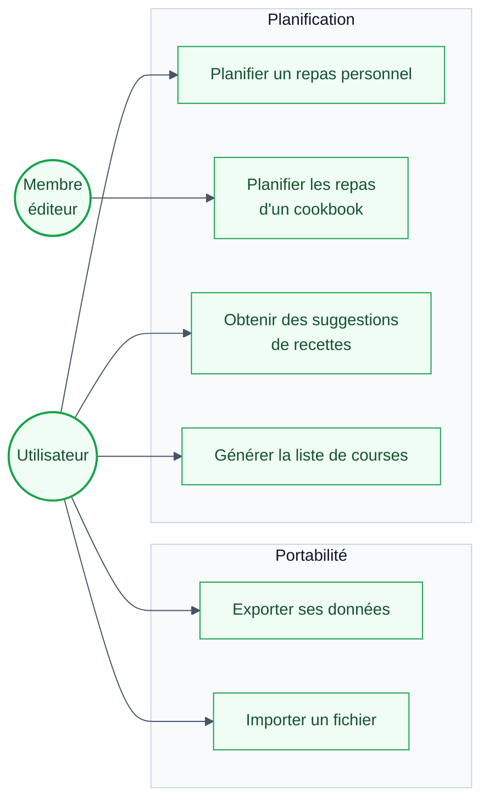

Un planning rattaché à un cookbook est **visible de tous ses membres**, mais seuls `CREATOR` et
`EDITOR` peuvent le remanier (`PLAN_WRITE_ROLES`, §7.7) — d'où UC27 réservé à l'éditeur. UC28
détaille les suggestions classées pour un créneau donné, traitées au §10.

Le seuil de chaque action figure dans la matrice des droits du §7.5 ; le §4.5 montre son application
au fil d'un échange temps réel.

### 4.2 Diagramme de classes — modèle de données

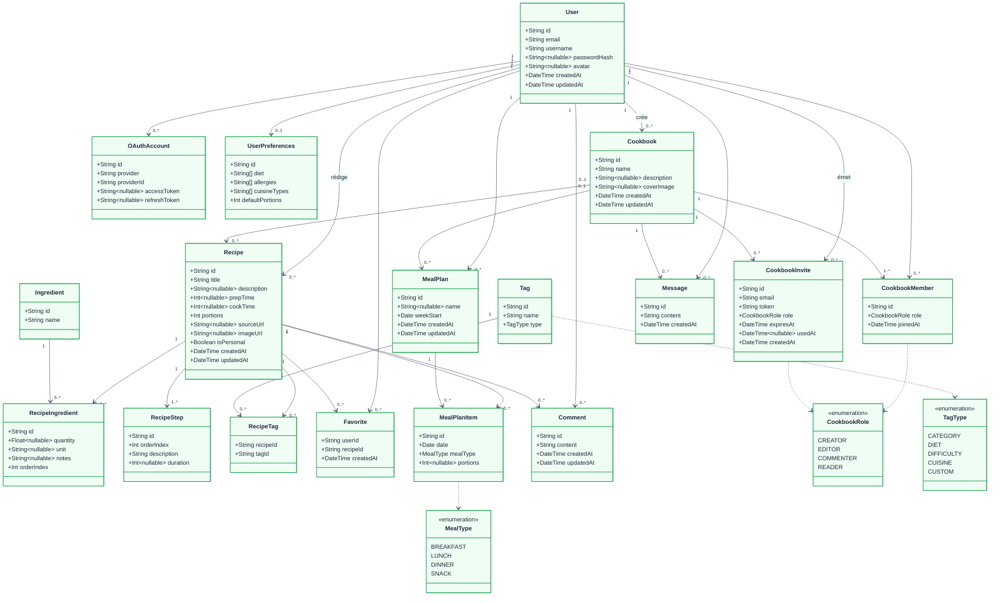

`RecipeIngredient` et `CookbookMember` sont des **classes-association** : elles portent des
attributs propres à la relation — quantité, unité, notes et rang pour un ingrédient, rôle et date
d'adhésion pour un membre — et ne peuvent donc pas être réduites à une table de jonction.

`RecipeTag` et `Favorite` sont, elles, des **tables de jonction** : leur identifiant est le couple
de clés étrangères. `RecipeTag` n’a rien d’autre ; `Favorite` porte en plus un `createdAt`, qui
date le geste sans le qualifier. La distinction n'est pas
cosmétique : une classe-association peut gagner des attributs, une table de jonction ne le peut pas
sans changer de nature.

Deux associations sont **optionnelles côté cookbook** — `Recipe` et `MealPlan`. C'est le cas nominal
du produit : une recette sans cookbook est une recette personnelle (`isPersonal` en est dérivé), et un
planning sans cookbook n'appartient qu'à son auteur. D'où la cardinalité `0..1` et non `1`.

Le modèle objet du projet **est** son modèle de données : la couche applicative est fonctionnelle et
n'expose qu'une seule classe (`AppError`). Son découpage se lit au §4.6, pas ici.

### 4.3 Diagramme de séquence — connexion et rafraîchissement de jeton

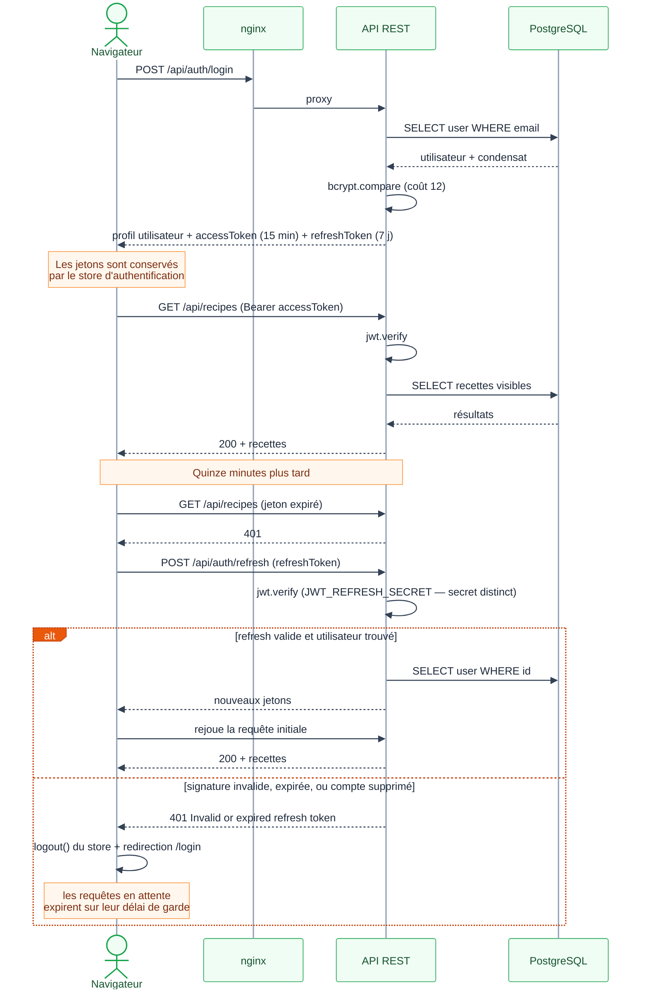

L'intercepteur HTTP du client sérialise les rafraîchissements : les requêtes concurrentes qui
échouent en `401` attendent le nouveau jeton au lieu de déclencher chacune sa propre rotation.

Les trois causes de refus renvoient **le même message**. Une signature invalide, un jeton expiré
et un compte supprimé entre-temps donnent tous `401 Invalid or expired refresh token` : le
client n’a pas à les distinguer, et l’API ne renseigne pas un attaquant sur l’existence du
compte.

À l’échec, les requêtes déjà mises en attente ne sont pas rejetées activement : leur rappel est
écarté de la file et chacune se règle sur son propre délai de garde de 15 s — en pratique la
redirection vers `/login` décharge la page avant.

Deux points que le diagramme rend visibles et qui ont leur importance. Le jeton de rafraîchissement
est **vérifié avec un secret distinct** de celui des jetons d'accès : compromettre l'un ne suffit pas
à forger l'autre. Et il n'est **pas** transporté par cookie `httpOnly` mais dans le corps des
requêtes, conservé par le store côté client — choix qui simplifie le CSRF au prix d'une exposition
au XSS, assumé ici et discuté au §6.

### 4.4 Diagramme de séquence — rattachement d'un fournisseur OAuth2

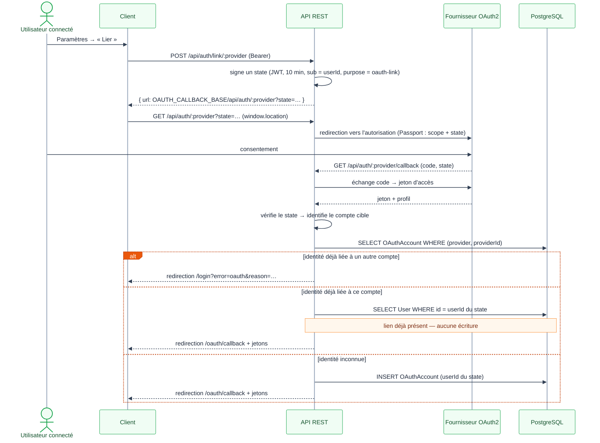

Le `state` est ce qui distingue un **rattachement** d'une **connexion** : sans lui, le callback ne
peut que rapprocher les comptes par adresse e-mail, et crée un second compte lorsqu'elles diffèrent.

L'URL renvoyée par `POST /api/auth/link/:provider` **n'est pas celle du fournisseur** mais celle de
l'API elle-même. Ce détour est ce qui permet à Passport de composer la requête d'autorisation
(`scope`, `state`) sans que le client ait à connaître les paramètres propres à chaque fournisseur.

Le rattachement est **idempotent** : relier deux fois la même identité au même compte ne crée pas
de seconde ligne — la contrainte unique `(provider, providerId)` l’interdirait — et ne réécrit
pas non plus les jetons du fournisseur. Le seul `UPDATE` de ces jetons appartient au flux de
**connexion**, inatteignable dès qu’un `state` valide accompagne le callback.

### 4.5 Diagramme de séquence — messagerie temps réel et permissions

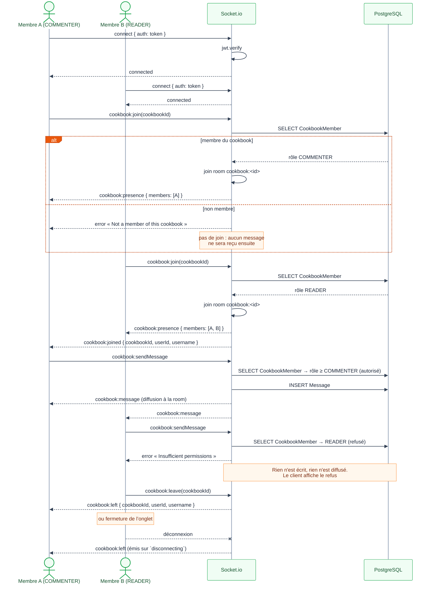

Le seuil d'écriture est `COMMENTER`, **pas** `EDITOR` : le gestionnaire ne refuse que le rôle
`READER`. C'est pourquoi le membre A du scénario est un simple `COMMENTER` — le montrer avec un
`EDITOR` laisserait croire à un seuil plus haut qu'il ne l'est.

L'appartenance est vérifiée **deux fois**, au `cookbook:join` puis à chaque `cookbook:sendMessage`.
La redondance est voulue : un rôle peut être abaissé pendant que la connexion reste ouverte, et
seule la seconde vérification le voit.

Cette course est le **seul chemin** par lequel un utilisateur voit le refus
`Insufficient permissions`. En régime normal l’interface désactive la saisie dès que `canChat`
est faux, et le gestionnaire de soumission s’arrête avant d’émettre : le refus serveur est donc
inatteignable. Il ne devient visible que si le rôle change **après** le chargement de la page,
le cache de droits du client étant alors périmé :

| Moment | État |
|---|---|
| charlie ouvre le salon | `COMMENTER`, saisie active |
| alice le rétrograde | `READER` côté serveur, cache client encore `COMMENTER` |
| charlie envoie | le serveur refuse, le client affiche « Votre rôle ne permet pas d’écrire dans ce salon » |

C’est ce que vaut la seconde vérification : sans elle, un message serait écrit malgré la
rétrogradation.

**Les cinq événements sont consommés par le client.** L’onglet Chat affiche une barre de
présence — compteur et avatars empilés — et traduit les refus en notification.

Deux subtilités expliquent la présence de `cookbook:presence`, qui pourrait sembler redondant
avec `cookbook:joined`.

`socket.to()` **exclut l’émetteur**. Un arrivant ne reçoit donc pas son propre
`cookbook:joined` et n’a aucun moyen de savoir qui est déjà là : sa liste resterait vide jusqu’à
la prochaine arrivée. Le serveur lui envoie l’état courant de la room en réponse au join.

Cet état est **dédupliqué par utilisateur**, pas par socket : un même compte ouvert dans deux
onglets tient deux connexions et figurerait deux fois. La déduplication passe par `socket.data`,
seul champ que Socket.io conserve sur les `RemoteSocket` renvoyés par `fetchSockets()`.

Enfin, fermer un onglet n’émet aucun `cookbook:leave`. Sans traitement, un utilisateur restait
affiché comme présent chez les autres jusqu’à leur propre rechargement. Le gestionnaire est
branché sur **`disconnecting`** et non `disconnect` : c’est le seul moment où `socket.rooms`
contient encore les rooms quittées.

### 4.6 Diagramme de composants et de déploiement

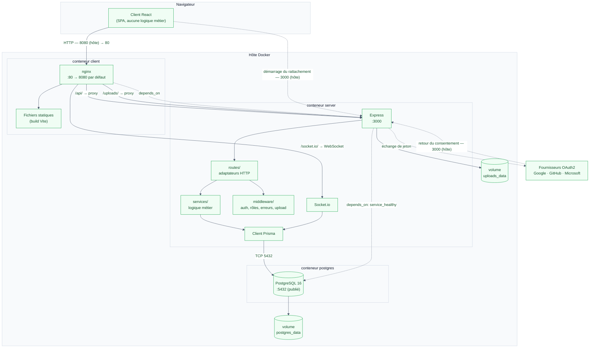

Les trois briques du §3 — backend, frontend, base de données — correspondent aux trois conteneurs.
Pour le trafic applicatif, le navigateur ne joint jamais l’API directement : nginx relaie
`/api/`, `/uploads/` et `/socket.io/`, ce qui évite toute configuration CORS côté client.

**Le rattachement OAuth2 fait exception, par deux trajets** — tous deux construits sur
`OAUTH_CALLBACK_BASE`, dont la valeur par défaut est `http://localhost:3000` :

1. **Le démarrage.** `POST /api/auth/link/:provider` renvoie une URL **absolue** vers l’API, et le
   client y navigue par `window.location.href` — donc directement sur le port 3000.
2. **Le retour.** Le `redirect_uri` transmis au fournisseur vaut
   `OAUTH_CALLBACK_BASE/api/auth/<provider>/callback` : après consentement, le fournisseur
   redirige le navigateur sur ce même port.

La **connexion** OAuth2, elle, passe bien par nginx : son bouton utilise un lien relatif, car
`VITE_API_URL` est vide en Docker. C’est ce qui rend la publication du port `3000` nécessaire, et
non un simple confort de débogage.

**Ports publiés sur l’hôte.** Le client est exposé en `8080→80` : le port `80` du schéma n’est
joignable que depuis le réseau Docker, et c’est bien `http://localhost:8080` qu’il faut ouvrir.
L’API (`3000`) et PostgreSQL (`5432`) sont également publiés — le premier pour les callbacks
OAuth2 et le débogage, le second pour l’inspection de la base.

Ces trois valeurs sont des **défauts**, portés par `CLIENT_PORT`, `SERVER_PORT` et
`POSTGRES_PORT` : une collision avec un autre conteneur se règle dans `.env`, sans toucher au
fichier Compose. Les ports internes du schéma, eux, ne varient pas.

**Aucun TLS dans cette pile.** L'arête d'entrée est en clair : nginx n'écoute que sur `:80`, sans
`ssl_certificate` ni `listen 443`. Une mise en production exigerait un terminateur TLS en amont ;
l'écrire ici serait plus honnête que de dessiner un HTTPS que le dépôt n'implémente pas.

**Ordonnancement du démarrage.** Les deux arêtes pointillées ne sont pas symétriques : `server`
attend que la sonde `pg_isready` de `postgres` soit saine (`condition: service_healthy`), tandis que
`client` se contente du démarrage du conteneur `server`, sans attendre son `healthcheck`. nginx peut
donc accepter des connexions quelques secondes avant que l'API ne réponde.

### 4.7 Diagramme d'activité — création d'une recette

```mermaid
%%{init: {"theme":"base","themeVariables":{"fontFamily":"Inter, Roboto, Helvetica, Arial, sans-serif","fontSize":"15px","primaryColor":"#f0fdf4","primaryTextColor":"#14532d","primaryBorderColor":"#16a34a","secondaryColor":"#f8fafc","secondaryTextColor":"#1e293b","secondaryBorderColor":"#cbd5e1","tertiaryColor":"#ffffff","tertiaryTextColor":"#1e293b","tertiaryBorderColor":"#e2e8f0","lineColor":"#475569","textColor":"#1e293b","clusterBkg":"#f8fafc","clusterBorder":"#cbd5e1","edgeLabelBackground":"#ffffff","titleColor":"#0f172a","actorBkg":"#f0fdf4","actorBorder":"#16a34a","actorTextColor":"#14532d","actorLineColor":"#94a3b8","signalColor":"#334155","signalTextColor":"#1e293b","labelBoxBkgColor":"#ea580c","labelBoxBorderColor":"#c2410c","labelTextColor":"#ffffff","loopTextColor":"#1e293b","noteBkgColor":"#fff7ed","noteBorderColor":"#fb923c","noteTextColor":"#7c2d12","activationBkgColor":"#dcfce7","activationBorderColor":"#16a34a","attributeBackgroundColorOdd":"#ffffff","attributeBackgroundColorEven":"#f8fafc"}}}%%
flowchart TD
    A([Utilisateur clique « Nouvelle recette »]) --> B[Saisie du formulaire]
    B --> B1{"Champs requis remplis ?<br/>react-hook-form, côté client"}
    B1 -->|Non| B2["Erreurs sous les champs<br/>aucune requête envoyée"]
    B1 -->|Oui| C{Cookbook sélectionné ?}
    C -->|Non| D["POST /api/recipes<br/>cookbookId absent"]
    C -->|Oui| E["POST /api/recipes<br/>cookbookId fourni"]

    D --> H
    E --> H["Validation Zod du corps entier<br/>chaînes vides et NaN → null"]
    H --> I{Entrées valides ?}
    I -->|Non| J[400 + erreurs par champ]
    I -->|Oui| F{cookbookId fourni ?}
    F -->|Non| K
    F -->|Oui| F2{"Rôle CREATOR ou EDITOR<br/>dans ce cookbook ?"}
    F2 -->|Non| G[403 Insufficient permissions]
    F2 -->|Oui| K

    K["portions ?? defaultPortions<br/>des préférences ?? 4"]
    K --> K2["Canonicalisation<br/>upsert ingrédients et tags"]
    K2 --> L["isPersonal = !cookbookId"]
    L --> M[INSERT Recipe + relations]
    M --> Q([201 Created, recette renvoyée])
    Q --> N{Photo fournie ?}
    N -->|Non| P([Redirection vers /recipes/:id])
    N -->|Oui| O["POST /api/recipes/:id/image<br/>UUID + volume dédié"]
    O --> O1{"Upload accepté ?<br/>extension jpg/jpeg/png/webp/gif<br/>et taille ≤ 5 Mo"}
    O1 -->|Oui| P
    O1 -->|Non| O2["Recette créée sans photo<br/>message d'erreur, pas de redirection"]

    classDef refus fill:#fff7ed,stroke:#ea580c,stroke-width:2px,color:#7c2d12
    classDef succes fill:#dcfce7,stroke:#16a34a,stroke-width:2px,color:#14532d
    class B2,J,G,O2 refus
    class Q,P succes
```

Trois points où ce diagramme corrige une intuition courante.

**La validation précède le contrôle de rôle.** La route parse le corps avec Zod, puis seulement
ensuite le service vérifie l'appartenance au cookbook. Un membre `READER` qui envoie un corps
invalide reçoit donc un `400`, pas le `403` auquel on s'attendrait — l'ordre inverse serait
défendable, mais c'est celui-ci qui est implémenté.

**Le `201` n'attend pas la photo.** L'image part dans un **second** appel, et c'est l'identifiant
renvoyé par le `201` qui le rend possible. La recette existe donc avant la photo, ce qui explique
l'état final `O2` : un upload refusé laisse une recette bien créée, sans image, l'utilisateur
restant sur le formulaire.

Le filtre d’upload porte sur l’**extension** du nom de fichier, pas sur le type MIME déclaré :
un fichier quelconque renommé en `.png` passe, un vrai JPEG sans extension est refusé. La limite
de 5 Mo, elle, est appliquée sur la taille réelle.

**Le formulaire filtre en amont.** Titre, portions, nom de chaque ingrédient et description de chaque
étape sont requis côté client : tant qu'un champ manque, aucune requête n'est émise. La validation
serveur n'en est pas moins complète — elle ne délègue rien au client, elle évite seulement un
aller-retour.

### 4.8 Diagramme d'états-transitions — invitation et adhésion

`CookbookInvite` est la seule entité du modèle à porter un **état persisté**, déduit de deux colonnes :
`usedAt` et `expiresAt`. Ses règles étaient jusqu'ici dispersées entre le code et la référence d'API ;
les voici en un seul endroit.

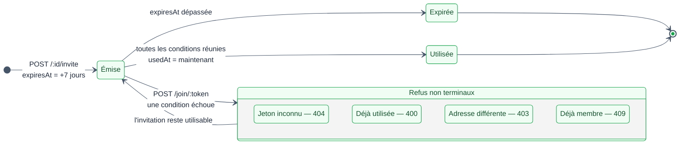

Le passage à `Utilisée` et la création du membre ont lieu dans **une seule transaction** : une
invitation ne peut donc pas être consommée sans que l'adhésion existe, ni l'inverse.

L'ordre des quatre refus n'est pas indifférent — il va du moins au plus informatif. Le contrôle
d'adresse (`403`) est ce qui rend l'invitation **nominative** : sans lui, le jeton serait un simple
porteur et quiconque l'intercepterait pourrait rejoindre le cookbook.

Aucun de ces quatre refus ne consomme l'invitation : l'état reste `Émise`, et un utilisateur qui
s'est trompé de compte peut réessayer avec le bon. Il n'existe en revanche **aucune révocation** :
une invitation émise ne peut pas être annulée avant son échéance, limite assumée que borne la durée
de vie de 7 jours.

L'adhésion qui en résulte a son propre cycle, plus simple :

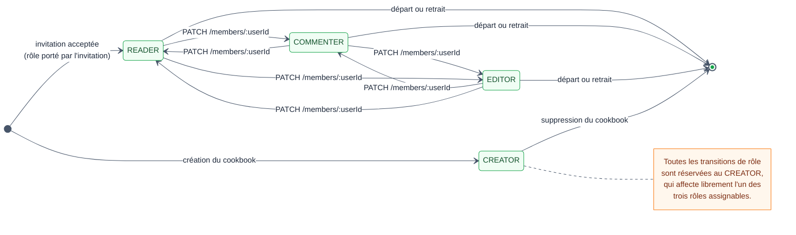

`CREATOR` est **hors du graphe des transitions** : il naît avec le cookbook et `ASSIGNABLE_ROLES` ne
le contient pas. Il n'y a donc ni promotion vers `CREATOR`, ni transfert de propriété — et par
conséquent aucune sortie possible pour le créateur sauf supprimer le cookbook. Un cookbook conserve
ainsi toujours au moins un membre, ce qui justifie la cardinalité `1..N` du §5.2.

Le créateur ne peut pas non plus changer **son propre** rôle, ni se retirer lui-même de la liste des
membres : les deux gardes existent pour éviter un cookbook orphelin.

---
---
## 5. Schéma de la base de données

### 5.1 Modèle logique (entités–associations)

Aucune directive `@@map` n'est utilisée dans `schema.prisma` : **les tables portent exactement le nom
des modèles Prisma**, en PascalCase, et doivent donc être citées entre guillemets en SQL
(`SELECT * FROM "Recipe"`).

```mermaid
%%{init: {"theme":"base","themeVariables":{"fontFamily":"Inter, Roboto, Helvetica, Arial, sans-serif","fontSize":"15px","primaryColor":"#f0fdf4","primaryTextColor":"#14532d","primaryBorderColor":"#16a34a","secondaryColor":"#f8fafc","secondaryTextColor":"#1e293b","secondaryBorderColor":"#cbd5e1","tertiaryColor":"#ffffff","tertiaryTextColor":"#1e293b","tertiaryBorderColor":"#e2e8f0","lineColor":"#475569","textColor":"#1e293b","clusterBkg":"#f8fafc","clusterBorder":"#cbd5e1","edgeLabelBackground":"#ffffff","titleColor":"#0f172a","actorBkg":"#f0fdf4","actorBorder":"#16a34a","actorTextColor":"#14532d","actorLineColor":"#94a3b8","signalColor":"#334155","signalTextColor":"#1e293b","labelBoxBkgColor":"#ea580c","labelBoxBorderColor":"#c2410c","labelTextColor":"#ffffff","loopTextColor":"#1e293b","noteBkgColor":"#fff7ed","noteBorderColor":"#fb923c","noteTextColor":"#7c2d12","activationBkgColor":"#dcfce7","activationBorderColor":"#16a34a","attributeBackgroundColorOdd":"#ffffff","attributeBackgroundColorEven":"#f8fafc"}}}%%
erDiagram
    User ||--o{ OAuthAccount : "possède"
    User ||--o| UserPreferences : "paramètre"
    User ||--o{ Cookbook : "crée"
    User ||--o{ CookbookMember : "adhère"
    User ||--o{ CookbookInvite : "émet"
    User ||--o{ Recipe : "rédige"
    User ||--o{ Favorite : "marque"
    User ||--o{ MealPlan : "planifie"
    User ||--o{ Comment : "commente"
    User ||--o{ Message : "publie"

    Cookbook ||--|{ CookbookMember : "regroupe"
    Cookbook ||--o{ CookbookInvite : "propose"
    Cookbook |o--o{ Recipe : "contient"
    Cookbook ||--o{ Message : "héberge"
    Cookbook |o--o{ MealPlan : "partage"

    Recipe ||--|{ RecipeIngredient : "compose"
    Recipe ||--|{ RecipeStep : "détaille"
    Recipe ||--o{ RecipeTag : "classe"
    Recipe ||--o{ Favorite : "figure dans"
    Recipe ||--o{ Comment : "reçoit"
    Recipe ||--o{ MealPlanItem : "programme"

    Ingredient ||--o{ RecipeIngredient : "référencé par"
    Tag ||--o{ RecipeTag : "attribué par"
    MealPlan ||--o{ MealPlanItem : "contient"

    User {
        String id PK
        String email UK
        String username UK
        String passwordHash "nullable — absent si OAuth2 seul"
        String avatar "nullable"
        DateTime createdAt
        DateTime updatedAt
    }

    OAuthAccount {
        String id PK
        String userId FK
        String provider UK "google | github | microsoft"
        String providerId UK
        String accessToken "nullable"
        String refreshToken "nullable"
    }

    UserPreferences {
        String id PK
        String userId FK,UK
        String_array diet
        String_array allergies
        String_array cuisineTypes
        Int defaultPortions "défaut 4"
    }

    Cookbook {
        String id PK
        String name
        String description "nullable"
        String coverImage "nullable"
        String createdById FK
        DateTime createdAt
        DateTime updatedAt
    }

    CookbookMember {
        String id PK
        String cookbookId FK,UK
        String userId FK,UK
        CookbookRole role "CREATOR | EDITOR | COMMENTER | READER"
        DateTime joinedAt
    }

    CookbookInvite {
        String id PK
        String cookbookId FK
        String email "destinataire nominatif"
        String token UK
        CookbookRole role
        String invitedById FK
        DateTime expiresAt
        DateTime usedAt "nullable"
        DateTime createdAt
    }

    Recipe {
        String id PK
        String title
        String description "nullable"
        Int prepTime "nullable, minutes"
        Int cookTime "nullable, minutes"
        Int portions "défaut 4"
        String sourceUrl "nullable"
        String imageUrl "nullable"
        Boolean isPersonal "dérivé de cookbookId"
        String createdById FK
        String cookbookId FK "nullable"
        DateTime createdAt
        DateTime updatedAt
    }

    Ingredient {
        String id PK
        String name UK "forme canonique, minuscules"
    }

    RecipeIngredient {
        String id PK
        String recipeId FK
        String ingredientId FK
        Float quantity "nullable"
        String unit "nullable"
        String notes "nullable"
        Int orderIndex
    }

    RecipeStep {
        String id PK
        String recipeId FK
        Int orderIndex
        String description
        Int duration "nullable, minutes"
    }

    Tag {
        String id PK
        String name UK "forme canonique"
        TagType type "CATEGORY | DIET | DIFFICULTY | CUISINE | CUSTOM"
    }

    RecipeTag {
        String recipeId PK,FK
        String tagId PK,FK
    }

    Favorite {
        String userId PK,FK
        String recipeId PK,FK
        DateTime createdAt
    }

    MealPlan {
        String id PK
        String userId FK
        String cookbookId FK "nullable"
        String name "nullable"
        Date weekStart "lundi de la semaine"
        DateTime createdAt
        DateTime updatedAt
    }

    MealPlanItem {
        String id PK
        String mealPlanId FK
        String recipeId FK
        Date date
        MealType mealType "BREAKFAST | LUNCH | DINNER | SNACK"
        Int portions "nullable — surcharge les portions de la recette"
    }

    Comment {
        String id PK
        String recipeId FK
        String userId FK
        String content
        DateTime createdAt
        DateTime updatedAt
    }

    Message {
        String id PK
        String cookbookId FK
        String userId FK
        String content
        DateTime createdAt
    }
```

#### Les trois niveaux, et où les lire

La dénomination compte pour qui lit ce document avec une grille Mérise, car les trois niveaux sont
bien présents mais répartis sur deux chapitres :

| Niveau | Où | Ce qui le caractérise ici |
|---|---|---|
| **Conceptuel** (MCD) | §4.2, diagramme de classes | Associations nommées plutôt que réifiées ; `RecipeIngredient` et `CookbookMember` y sont des classes-association |
| **Logique** (MLD) | §5.1, ci-dessus | Les clés étrangères apparaissent, les associations porteuses sont devenues des tables, les clés primaires composites sont explicites |
| **Physique** (MPD) | §5.6 et `docs/schema-physique.sql` | Types PostgreSQL, index, actions référentielles |

Le diagramme du §5.1 montre `String userId FK` et la clé primaire composite de `RecipeTag` : au
sens strict, il s'agit donc d'un **MLD**, pas d'un MCD. Le niveau conceptuel est tenu par le §4.2,
où les associations sont nommées plutôt que réifiées.

Une réserve, pour être exact : le §4.2 n'est pas totalement exempt de clés étrangères — `RecipeTag`
et `Favorite` y montrent les leurs, faute de quoi ces deux classes seraient vides. Un MCD
strictement orthodoxe les remplacerait par de simples associations nommées ; les garder rend le
diagramme plus utile au lecteur qui code, au prix de cette entorse assumée.

#### Notation relationnelle

Le même MLD en notation textuelle, pour la lecture rapide : clé primaire <u>soulignée</u>, clé
étrangère préfixée de `#`, attribut facultatif suivi de `*`.

- `User`(<u>id</u>, email, username, passwordHash *, avatar *, createdAt, updatedAt)
- `OAuthAccount`(<u>id</u>, #userId, provider, providerId, accessToken *, refreshToken *) — clé alternative (provider, providerId)
- `UserPreferences`(<u>id</u>, #userId, diet, allergies, cuisineTypes, defaultPortions)
- `Cookbook`(<u>id</u>, name, description *, coverImage *, #createdById, createdAt, updatedAt)
- `CookbookMember`(<u>id</u>, #cookbookId, #userId, role, joinedAt) — clé alternative (cookbookId, userId)
- `CookbookInvite`(<u>id</u>, #cookbookId, email, token, role, #invitedById, expiresAt, usedAt *, createdAt)
- `Recipe`(<u>id</u>, title, description *, prepTime *, cookTime *, portions, sourceUrl *, imageUrl *, isPersonal, #createdById, #cookbookId *, createdAt, updatedAt)
- `Ingredient`(<u>id</u>, name)
- `RecipeIngredient`(<u>id</u>, #recipeId, #ingredientId, quantity *, unit *, notes *, orderIndex)
- `RecipeStep`(<u>id</u>, #recipeId, orderIndex, description, duration *)
- `Tag`(<u>id</u>, name, type)
- `RecipeTag`(<u>#recipeId, #tagId</u>)
- `Favorite`(<u>#userId, #recipeId</u>, createdAt)
- `MealPlan`(<u>id</u>, #userId, #cookbookId *, name *, weekStart, createdAt, updatedAt)
- `MealPlanItem`(<u>id</u>, #mealPlanId, #recipeId, date, mealType, portions *)
- `Comment`(<u>id</u>, #recipeId, #userId, content, createdAt, updatedAt)
- `Message`(<u>id</u>, #cookbookId, #userId, content, createdAt)

Deux relations se distinguent : `RecipeTag` et `Favorite` n'ont **que** leur clé primaire composite
(plus une date pour la seconde), ce qui les identifie comme tables de jonction pures ; `Recipe` et
`MealPlan` portent une clé étrangère `#cookbookId *` **facultative**, qui est exactement ce qui
distingue le personnel du partagé.


### 5.2 Cardinalités et règles structurantes

| Association | Cardinalité | Justification |
|---|---|---|
| `Cookbook` → `CookbookMember` | 1 → 1..N | Un cookbook a toujours au moins son créateur ; celui-ci ne peut pas le quitter. |
| `Recipe` → `RecipeIngredient` | 1 → 1..N | Au moins un ingrédient, sur **les deux** chemins d’écriture : `recipeSchema` à la création, et une garde explicite à l’import. |
| `Recipe` → `RecipeStep` | 1 → 1..N | Idem pour les étapes. |
| `Recipe` → `Cookbook` | 0..1 | Une recette sans cookbook est personnelle (`isPersonal = true`). |
| `User` → `UserPreferences` | 1 → 0..1 | Créées à l'inscription, absentes pour les comptes anciens. |
| `Ingredient` / `Tag` | catalogues partagés | Un même ingrédient est référencé par toutes les recettes qui l'emploient, ce qui rend le filtrage par ingrédient exact. |

### 5.3 Clés et contraintes d'unicité

| Table | Contrainte | Effet |
|---|---|---|
| `User` | `email` unique, `username` unique | Un compte par adresse ; nom d'utilisateur non ambigu. |
| `OAuthAccount` | `(provider, providerId)` unique | Une identité de fournisseur ne peut être rattachée qu'à un seul compte. |
| `CookbookMember` | `(cookbookId, userId)` unique | Une adhésion unique par personne et par cookbook. |
| `CookbookInvite` | `token` unique | Le jeton identifie l'invitation. |
| `Ingredient`, `Tag` | `name` unique | Impose la forme canonique. |
| `RecipeTag` | clé primaire `(recipeId, tagId)` | Un tag ne peut être posé deux fois. |
| `Favorite` | clé primaire `(userId, recipeId)` | Un favori est un fait, pas un compteur. |

### 5.4 Suppressions en cascade

| Suppression de | Entraîne |
|---|---|
| `User` | comptes OAuth, préférences, adhésions, favoris, plannings, commentaires, messages |
| `Cookbook` | adhésions, invitations, **recettes du cookbook**, messages |
| `Recipe` | ingrédients, étapes, tags, favoris, commentaires, **entrées de planning** |
| `MealPlan` | ses entrées |

Le tableau ci-dessus ne dit pas tout. Sur les **24 clés étrangères** du schéma, 19 cascadent, mais
cinq ne cascadent pas :

| Action | Clés concernées | Effet |
|---|---|---|
| `SET NULL` | `MealPlan.cookbookId` | Supprimer un cookbook **ne supprime pas** les plannings partagés : `cookbookId` repasse à `NULL` et le planning redevient personnel. |
| `RESTRICT` | `Cookbook.createdById`, `Recipe.createdById`, `CookbookInvite.invitedById`, `RecipeIngredient.ingredientId` | La suppression du parent est **refusée** par la base tant qu’un enfant le référence. |

Les quatre `RESTRICT` ne sont pas un choix explicite : ils sont le **défaut de Prisma** pour une
relation obligatoire sans `onDelete`. Leur effet contredit ce que la première ligne du tableau
laisse attendre — supprimer un utilisateur qui a créé un cookbook ou rédigé une recette serait
rejeté par PostgreSQL, pas cascadé.

En pratique, aucun de ces chemins n’est atteignable : **l’API n’expose ni suppression de compte,
ni suppression d’ingrédient ou de tag**. La contrainte tient donc le rôle d’un garde-fou plutôt
que d’une règle métier — mais une évolution qui ajouterait la suppression de compte devrait la
traiter d’abord.

Le `SET NULL`, lui, est délibéré : supprimer un cookbook détruit ses recettes, mais pas le travail
de planification de ses membres. `docs/schema-physique.sql` porte les trois actions au niveau
physique.

La cascade `Recipe` → `MealPlanItem` est, elle, indispensable : sans elle, supprimer une recette
déjà planifiée violait la contrainte de clé étrangère et échouait en erreur 500.

### 5.5 Index

Les index déclarés dans `schema.prisma` couvrent les colonnes de jointure et de tri
(`Recipe.createdById`, `Recipe.cookbookId`, `Recipe.title`, `Message.createdAt`, `MealPlan.weekStart`,
`MealPlanItem.date`, etc.).

La recherche plein texte demande davantage : un `LIKE '%terme%'` ne peut exploiter aucun index
B-tree. `server/src/config/searchIndex.ts` complète donc le schéma au démarrage, en DDL idempotente :

| Objet | Rôle |
|---|---|
| extension `unaccent` | retire les diacritiques |
| extension `pg_trgm` | index de trigrammes, seuls capables de servir un `LIKE` avec joker en tête |
| fonction `supmeal_normalize(text)` | `lower(unaccent(...))`, déclarée `IMMUTABLE` pour être indexable |
| index GIN | `Recipe.title`, `Recipe.description`, `RecipeStep.description`, `Ingredient.name`, `Tag.name` |

Ces objets sortent du périmètre de `prisma db push`, qui ne sait déclarer ni extension ni index
fonctionnel. Si les extensions ne peuvent pas être créées — base managée sans droits
superutilisateur — le serveur émet un avertissement et la recherche retombe sur `ILIKE`, sensible
aux accents et non indexée, sans que l'application cesse de fonctionner.

### 5.6 Modèle physique (MPD)

Le modèle physique complet est un livrable à part : **[`docs/schema-physique.sql`](schema-physique.sql)**
— 17 `CREATE TABLE`, 3 `CREATE TYPE` (énumérations natives), 36 index et 24 contraintes de clé
étrangère avec leurs actions référentielles.

Il est **généré**, jamais édité à la main, ce qui garantit qu'il ne peut pas dériver du schéma :

```bash
node scripts/check-schema-physique.mjs            # échoue si le fichier a dérivé du schéma
node scripts/check-schema-physique.mjs --write    # le régénère, en-tête compris
```

Le contrôle sans `--write` existe pour une raison : **un fichier généré et versionné n’a de
valeur que s’il est vrai**. Une évolution du schéma Prisma sans régénération laisserait un
modèle physique périmé dans la documentation — pire qu’aucun modèle, puisqu’un lecteur lui fait
confiance. La comparaison porte sur la DDL seule, pas sur l’en-tête de commentaires :
reformuler une explication ne déclenche pas d’échec.

Correspondance des types, du niveau logique au niveau physique :

| Prisma | PostgreSQL 16 | Remarque |
|---|---|---|
| `String` `@id @default(cuid())` | `TEXT`, `PRIMARY KEY` | identifiant applicatif, pas de `SERIAL` : genérable côté client, non énumérable |
| `String` | `TEXT` | **sans borne** — les longueurs maximales sont applicatives, voir §5.7 |
| `String?` | `TEXT` (nullable) | |
| `String[]` | `TEXT[]` | tableau natif : `diet`, `allergies`, `cuisineTypes` |
| `Int` | `INTEGER` | |
| `Float` | `DOUBLE PRECISION` | `RecipeIngredient.quantity` |
| `Boolean` | `BOOLEAN` | |
| `DateTime` | `TIMESTAMP(3)` | précision milliseconde |
| `DateTime @db.Date` | `DATE` | `MealPlan.weekStart`, `MealPlanItem.date` — pas d'heure, donc pas de piège de fuseau |
| `enum` | `CREATE TYPE … AS ENUM` | `CookbookRole`, `TagType`, `MealType` — contrainte tenue par la base |
| `@@id([a, b])` | `PRIMARY KEY (a, b)` | `RecipeTag`, `Favorite` |

Deux précisions qui évitent un contresens à la lecture du fichier. Il n'existe **aucun dossier de
migrations** : le schéma est appliqué au démarrage par `prisma db push`, et ce SQL est une
**photographie** de l'état cible, pas un script à rejouer. Et il ne contient ni les extensions
`unaccent`/`pg_trgm`, ni la fonction `supmeal_normalize()`, ni les index GIN de recherche : ceux-là
ne dérivent pas du schéma Prisma et sont créés par `server/src/config/searchIndex.ts` (§5.5).

### 5.7 Dictionnaire de données — contraintes de saisie

Le §5.6 le montre : **aucune longueur n'est imposée par la base**, toutes les chaînes sont des
`TEXT`. Les bornes ci-dessous sont donc tenues entièrement par les schémas Zod, à la frontière HTTP.
Les connaître évite de prendre un `400` pour un bogue.

| Entité | Champ | Contrainte | Source |
|---|---|---|---|
| `User` | `email` | format e-mail, unique | `authService.ts` |
| `User` | `username` | 3 – 30, `^[a-zA-Z0-9_]+$`, unique | `authService.ts`, `userService.ts` |
| `User` | mot de passe | 8 – 100 à l'inscription et au changement | `authService.ts`, `userService.ts` |
| `UserPreferences` | `defaultPortions` | entier 1 – 100 | `userService.ts` |
| `Recipe` | `title` | 1 – 200, requis | `recipeService.ts` |
| `Recipe` | `description` | ≤ 2000, optionnel | `recipeService.ts` |
| `Recipe` | `portions` | entier 1 – 1000 ; défaut = préférences, sinon 4 | `recipeService.ts` |
| `Recipe` | `prepTime`, `cookTime` | entier positif, optionnels | `recipeService.ts` |
| `Recipe` | `sourceUrl` | URL valide, optionnel | `recipeService.ts` |
| `Recipe` | ingrédients, étapes | **au moins un de chaque** | `recipeService.ts` |
| `Ingredient` | `name` | 1 – 100 | `recipeService.ts` |
| `RecipeIngredient` | `unit` / `notes` | ≤ 50 / ≤ 200, optionnels | `recipeService.ts` |
| `RecipeStep` | `description` | requise, non vide | `recipeService.ts` |
| `Tag` | `name` | 1 – 50, unique après canonicalisation | `catalogService.ts` |
| `Cookbook` | `name` | 1 – 100 | `cookbookService.ts` |
| `Cookbook` | `description` | ≤ 500, optionnelle | `cookbookService.ts` |
| `CookbookInvite` | `email` | format e-mail | `cookbookService.ts` |
| `Comment` | `content` | 1 – 2000 | `recipeService.ts` |
| `MealPlan` | `name` | ≤ 100, optionnel | `mealPlanService.ts` |
| `MealPlanItem` | `date` | `YYYY-MM-DD` strict | `mealPlanService.ts` |
| `MealPlanItem` | `portions` | entier ≥ 1, optionnel | `mealPlanService.ts` |
| — | image de recette | `.jpg .jpeg .png .webp .gif`, ≤ 5 Mo | `middleware/upload.ts` |
| — | pagination | `page` ≥ 1 ; `limit` 1 – 50 (défaut 20) | `recipeService.ts` |
| — | semaine de planning | `offset` −520 – +520 (± 10 ans) | `mealPlanService.ts` |

Une chaîne vide n'est pas un refus : les champs optionnels du formulaire arrivent à `''` ou `NaN` et
sont ramenés à `null` avant validation. C'est délibéré — sans cette étape, remplir une recette sans
temps de cuisson échouait.

---
## 6. Sécurité

### Authentification

| Élément | Mise en œuvre | Référence |
|---|---|---|
| Hachage des mots de passe | bcrypt, coût 12 (adaptatif) | `server/src/routes/auth.ts:39` |
| Access token | JWT signé `HS256`, durée de vie 15 min | `server/src/middleware/auth.ts:61` |
| Refresh token | JWT signé avec un secret distinct, durée de vie 7 j | `server/src/middleware/auth.ts:64` |
| Rafraîchissement | Intercepteur Axios sur `401`, avec file d'attente des requêtes concurrentes | `client/src/api/client.ts` |
| OAuth2 | Google, GitHub, Microsoft via Passport ; stratégie enregistrée uniquement si ses variables d'environnement sont définies | `server/src/config/passport.ts` |

Le mot de passe n'est jamais stocké ni journalisé en clair : seul le condensat bcrypt est persisté
dans la colonne `users.passwordHash`, qui est nullable pour les comptes créés uniquement via OAuth2.

### Protections applicatives

- **Rate limiting** — 20 requêtes / 15 min sur les routes `/api/auth`, 500 requêtes / 15 min sur le
  reste de l'API. `app.set('trust proxy', 1)` est indispensable : sans lui, `req.ip` vaut l'adresse
  de nginx et tous les visiteurs sont comptés dans un seul seau, si bien qu'un utilisateur actif
  bloque l'authentification de tous les autres. Un seul saut est déclaré, nginx étant le seul
  intermédiaire.
- **Validation** — toutes les entrées des routes mutantes sont validées côté serveur avec Zod.
- **CORS** — origine restreinte à la valeur de `CLIENT_URL`.
- **Helmet** — en-têtes de sécurité HTTP : CSP, HSTS, `X-Content-Type-Options: nosniff`,
  `X-Frame-Options`, `Referrer-Policy`. La politique `crossOriginResourcePolicy` est assouplie en
  `cross-origin` pour permettre le service des images de recettes.
  *Helmet ne fournit pas de protection CSRF* ; celle-ci n'est pas nécessaire ici car
  l'authentification repose sur un en-tête `Authorization: Bearer` et non sur un cookie de session.
- **Taille des corps de requête** — limitée à 10 Mo (JSON et `urlencoded`).
- **Permissions** — système de rôles hiérarchique appliqué côté serveur
  (`CREATOR` > `EDITOR` > `COMMENTER` > `READER`), voir `server/src/middleware/permissions.ts`.

### Uploads de fichiers

- Taille limitée à **5 Mo** par fichier (`server/src/middleware/upload.ts`).
- Nom de fichier régénéré côté serveur avec un UUID v4 : le nom fourni par le client n'est jamais
  réutilisé, ce qui neutralise les tentatives de *path traversal*.
- Extensions autorisées : `.jpg`, `.jpeg`, `.png`, `.webp`, `.gif`.

> **Limite connue** : le filtre d'upload contrôle uniquement l'**extension** du fichier, et non son
> type MIME réel ni sa signature binaire. Un fichier arbitraire renommé en `.png` serait donc
> accepté. Le risque reste contenu (les fichiers sont servis en statique depuis un volume dédié,
> jamais interprétés côté serveur), mais un contrôle du `mimetype` Multer et de la signature du
> fichier constituerait un durcissement pertinent.

### Secrets

- Aucun secret n'est présent dans le code source ni dans le dépôt : `docker-compose.yml` lit
  exclusivement des variables d'environnement, et `POSTGRES_PASSWORD`, `JWT_SECRET` et
  `JWT_REFRESH_SECRET` n'ont volontairement aucune valeur de repli.
- Les variables d'environnement sont validées au démarrage par `server/src/config/env.ts` (schéma
  Zod). En l'absence d'un secret requis, le serveur **refuse de démarrer** avec un message explicite,
  plutôt que de retomber sur une valeur codée en dur qui serait publiquement connue et rendrait tous
  les jetons forgeables. Un avertissement est également émis si les secrets sont restés aux valeurs
  d'exemple.
- `.env` est exclu par `.gitignore` ; seul `.env.example`, qui ne contient que des valeurs
  d'exemple à remplacer, est versionné.
## 7. Référence de l'API REST

Toutes les routes sont préfixées par `/api`. Sauf mention contraire, elles exigent un en-tête
`Authorization: Bearer <accessToken>`.

### 7.1 Conventions

**Réponse en cas de succès**

```json
{ "success": true, "data": { } }
```

**Réponse en cas d'erreur**

```json
{ "success": false, "message": "Validation error", "errors": { "title": ["Required"] } }
```

**Codes employés**

| Code | Signification |
|---|---|
| `200` | Succès |
| `201` | Ressource créée |
| `400` | Entrée invalide — `errors` détaille les champs fautifs |
| `401` | Jeton absent, invalide ou expiré |
| `403` | Authentifié mais droits insuffisants |
| `404` | Ressource inexistante ou hors du périmètre visible |
| `409` | Conflit — unicité violée, ou ressource encore référencée |
| `503` | Fournisseur OAuth2 non configuré sur ce déploiement |

**Limitation de débit** — 20 requêtes / 15 min sur `/api/auth`, 500 requêtes / 15 min ailleurs.

**Pagination** — les listes paginées renvoient
`{ items, total, page, limit, totalPages }`. `limit` est plafonné à 50.

### 7.2 Authentification — `/api/auth`

| Méthode | Chemin | Auth | Description |
|---|---|:---:|---|
| `POST` | `/register` | — | Inscription. Corps : `email`, `username` (3–30, alphanumérique), `password` (≥ 8). Renvoie l'utilisateur et les deux jetons. |
| `POST` | `/login` | — | Connexion. Corps : `email`, `password`. |
| `POST` | `/refresh` | — | Échange un `refreshToken` contre une nouvelle paire de jetons. |
| `GET` | `/providers` | — | Fournisseurs OAuth2 réellement configurés : `{ providers: ["google", "github"] }`. |
| `POST` | `/link/:provider` | ✔ | Prépare le rattachement d'un fournisseur au compte courant. Renvoie une URL d'autorisation portant un `state` signé (10 min). |
| `GET` | `/google` · `/github` · `/microsoft` | — | Démarre le flux OAuth2. `503` si le fournisseur n'est pas configuré. |
| `GET` | `/google/callback` · `/github/callback` · `/microsoft/callback` | — | Retour du fournisseur. Redirige vers `CLIENT_URL/oauth/callback` avec les jetons, ou vers `/login?error=oauth&reason=…` en cas d'échec. |

### 7.3 Compte utilisateur — `/api/users`

| Méthode | Chemin | Description |
|---|---|---|
| `GET` | `/me` | Profil, préférences et fournisseurs liés. |
| `GET` | `/me/stats` | Compteurs du tableau de bord : `recipes`, `cookbooks`, `favorites`, `plannedThisWeek`. |
| `PATCH` | `/me` | Modifie `username` et/ou `avatar`. `409` si le nom est déjà pris. |
| `POST` | `/me/change-password` | Corps : `currentPassword`, `newPassword` (≥ 8). `400` pour un compte sans mot de passe (OAuth2 seul). |
| `PATCH` | `/me/preferences` | `diet[]`, `allergies[]`, `cuisineTypes[]`, `defaultPortions`. |

**Effet des préférences.** `defaultPortions` s'applique à toute recette créée sans nombre de
portions explicite, et le formulaire pré-remplit le champ. `allergies` est confronté aux ingrédients
sur `GET /api/recipes/:id`, qui renvoie `allergyWarnings[]` : la correspondance se fait par inclusion
sur les formes canoniques, si bien que « arachide » alerte sur « beurre d'arachide ». C'est un
avertissement affiché, jamais un blocage. `diet` et `cuisineTypes` restent déclaratifs.
| `DELETE` | `/me/oauth/:provider` | Dissocie un fournisseur. `400` si c'est le dernier moyen de connexion. |

### 7.4 Recettes — `/api/recipes`

| Méthode | Chemin | Description |
|---|---|---|
| `GET` | `/` | Recherche et filtrage. Paramètres ci-dessous. |
| `POST` | `/` | Création. Au moins un ingrédient et une étape. `isPersonal` est **dérivé** de `cookbookId` et refusé s'il est fourni. |
| `GET` | `/:id` | Détail, avec `isFavorite`, `comments` et `permissions.canEdit` / `canDelete`. |
| `PUT` | `/:id` | Modification. Ingrédients, étapes et tags sont **remplacés en bloc**. |
| `DELETE` | `/:id` | Suppression. Entraîne ses entrées de planning. |
| `POST` | `/:id/image` | Téléversement `multipart/form-data`, champ `image`. Extensions autorisées, 5 Mo maximum. |
| `POST` | `/:id/favorite` | Marque comme favorite. |
| `DELETE` | `/:id/favorite` | Retire des favoris. |
| `GET` | `/suggestions` | Suggestions classées pour un créneau (§10). Paramètres : `date?`, `mealType?`, `limit?` (≤ 10). |
| `GET` | `/:id/comments` | Commentaires. Réservé aux personnes ayant accès à la recette. |
| `POST` | `/:id/comments` | Ajoute un commentaire (≤ 2000 caractères). Refusé au rôle `READER`. |
| `DELETE` | `/:recipeId/comments/:commentId` | Supprime son propre commentaire. |

**Paramètres de `GET /api/recipes`**

| Paramètre | Type | Effet |
|---|---|---|
| `q` | texte | Recherche plein texte sur titre, description, **étapes**, ingrédients et tags. Insensible à la casse **et aux accents**. |
| `cookbookId` | id | Restreint à un cookbook — c'est la barre de recherche propre au cookbook (§2.2.2 du cahier des charges). |
| `tags` | liste séparée par virgules | Recettes portant l'un des tags. |
| `ingredients` | liste séparée par virgules | Correspondance partielle, insensible à la casse. |
| `maxPrepTime` | entier | `prepTime ≤ valeur`. |
| `maxCookTime` | entier | `cookTime ≤ valeur`. |
| `favorites` | `true` | Favoris de l'appelant uniquement. |
| `page`, `limit` | entiers | Pagination ; `limit` ≤ 50. |

Les critères se combinent en conjonction. Le filtre de visibilité est appliqué séparément et ne peut
être ni écrasé ni contourné : une recette personnelle n'appartient qu'à son auteur, une recette de
cookbook n'est visible que par les membres de ce cookbook.

### 7.5 Cookbooks — `/api/cookbooks`

| Méthode | Chemin | Rôle requis | Description |
|---|---|:---:|---|
| `GET` | `/` | — | Cookbooks de l'utilisateur, chacun avec `myRole` et `permissions`. |
| `POST` | `/` | — | Création ; l'auteur devient `CREATOR`. |
| `GET` | `/:id` | `READER` | Détail avec la liste des membres. |
| `PATCH` | `/:id` | `EDITOR` | Modifie nom et description. |
| `POST` | `/:id/cover` | `EDITOR` | Image de couverture (`multipart`, champ `image`). |
| `DELETE` | `/:id` | `CREATOR` | Supprime le cookbook **et ses recettes**. |
| `POST` | `/:id/invite` | `CREATOR` | Invitation nominative. Corps : `email`, `role`. Renvoie un `token` valable 7 jours. |
| `POST` | `/join/:token` | — | Accepte une invitation. `403` si l'adresse du compte ne correspond pas à celle invitée. |
| `PATCH` | `/:id/members/:userId` | `CREATOR` | Change le rôle. Le rôle `CREATOR` n'est pas attribuable. |
| `DELETE` | `/:id/members/:userId` | `CREATOR` | Retire un membre. |
| `DELETE` | `/:id/leave` | — | Quitter. Refusé au créateur. |
| `GET` | `/:cookbookId/messages` | `READER` | Historique du chat. `limit` ≤ 100, `before` pour paginer. |

**Droits par rôle** (renvoyés dans `permissions`)

| | `CREATOR` | `EDITOR` | `COMMENTER` | `READER` |
|---|:---:|:---:|:---:|:---:|
| Consulter les recettes | ✔ | ✔ | ✔ | ✔ |
| Lire le chat | ✔ | ✔ | ✔ | ✔ |
| Commenter / écrire dans le chat | ✔ | ✔ | ✔ | — |
| Créer et modifier des recettes | ✔ | ✔ | — | — |
| Consulter le planning du cookbook | ✔ | ✔ | ✔ | ✔ |
| Remanier le planning du cookbook | ✔ | ✔ | — | — |
| Gérer les membres et invitations | ✔ | — | — | — |
| Supprimer le cookbook | ✔ | — | — | — |

Les cinq premières lignes correspondent une à une aux drapeaux renvoyés dans `permissions`
(`getCookbookPermissions`). Les **deux lignes de planification** n'en font pas partie : le contrôle
est appliqué côté planning (`PLAN_WRITE_ROLES`, §7.7), avec le même seuil que l'écriture de
recettes. Les omettre laisserait croire qu'un planning de groupe n'est pas protégé par rôle.

### 7.6 Catalogues — `/api/tags`

| Méthode | Chemin | Description |
|---|---|---|
| `GET` | `/` | Tags, filtrables par `type`. |
| `POST` | `/` | Crée ou réutilise un tag. Corps : `name`, `type`. |
| `GET` | `/ingredients` | Autocomplétion. `q` pour filtrer, `limit` ≤ 50. |

### 7.7 Planification — `/api/meal-plans`

| Méthode | Chemin | Description |
|---|---|---|
| `GET` | `/` | Plannings de l'utilisateur. |
| `GET` | `/week?offset=N` | Semaine relative (`0` courante, `-1` précédente). Renvoie `weekStart`, `weekEnd`, les 7 `days`, `today`, un `defaultName` et le `plan` s'il existe. |
| `POST` | `/schedule` | Planifie une recette à une date : le serveur résout la semaine et crée le planning au besoin. Corps : `recipeId`, `date`, `mealType`, `portions?`, `planName?`. |
| `POST` | `/` | Crée un planning. Corps : `weekStart` (`YYYY-MM-DD`), `name?`, `cookbookId?`. Rattacher un cookbook exige d'y être `CREATOR` ou `EDITOR`. |
| `GET` | `/:id` | Détail d'un planning. |
| `DELETE` | `/:id` | Supprime un planning et ses entrées. |
| `POST` | `/:id/items` | Ajoute une entrée à un planning existant. |
| `DELETE` | `/:id/items/:itemId` | Retire une entrée. La suppression est cantonnée au planning indiqué. |
| `GET` | `/:id/shopping-list` | Liste de courses agrégée : `[{ name, totalQuantity, unit, notes[] }]`. |

**Plannings partagés.** Un planning dont `cookbookId` est renseigné appartient au cookbook et non à
son seul auteur : tous ses membres le voient et le retrouvent sur `GET /week`. Les rôles s'appliquent
comme pour les recettes — `CREATOR` et `EDITOR` remanient le planning, `COMMENTER` et `READER` le
consultent. C'est la forme que prend « planifier des repas ensemble » du §2.1 du cahier des charges. Un planning sans
`cookbookId` reste strictement personnel.

Lorsque plusieurs plannings couvrent la même semaine, `GET /week` privilégie le planning personnel :
un planning de groupe ne doit pas masquer celui que l'on tient pour soi.

L'agrégation regroupe par couple (ingrédient, unité), l'unité étant normalisée pour la comparaison —
`g` et `G` fusionnent. Aucune conversion entre unités différentes n'est tentée : 200 g et 0,2 kg
restent deux lignes.

### 7.8 Portabilité — `/api/export` et `/api/import`

| Méthode | Chemin | Description |
|---|---|---|
| `GET` | `/api/export?format=json` | Export complet et réimportable : recettes personnelles, celles créées dans les cookbooks de tiers dont on est encore membre, et cookbooks créés avec leurs recettes. |
| `GET` | `/api/export?format=csv` | Tableur. Format à plat, donc partiellement lossy. |
| `GET` | `/api/export?format=mealie` | Liste de recettes au vocabulaire schema.org, importable dans Mealie. Les cookbooks sont aplatis, Mealie n'ayant pas de notion équivalente. |
| `POST` | `/api/import` | `multipart/form-data`, champ `file`. 10 Mo maximum. Renvoie `{ recipes, cookbooks, errors[] }`. |

L'import reconnaît seul le format : JSON SUPMEAL, CSV, ou export Mealie / schema.org. L'utilisateur
devient `CREATOR` des cookbooks importés. Chaque cookbook est importé dans une transaction — il
arrive complet ou pas du tout — tandis que les erreurs sont rapportées élément par élément afin qu'un
fichier partiellement valide reste exploitable. Limites : 2000 recettes, 200 cookbooks par fichier.

### 7.9 Messagerie temps réel — Socket.io

Point de montage `/socket.io/`, relayé par nginx avec mise à niveau WebSocket.

**Connexion**

```js
io('http://localhost:8080', { auth: { token: accessToken } });
```

Le jeton est vérifié au *handshake* ; une connexion sans jeton valide est refusée.

| Sens | Événement | Charge utile | Description |
|---|---|---|---|
| → | `cookbook:join` | `cookbookId` | Rejoint le salon. Refusé si l'on n'est pas membre. |
| → | `cookbook:leave` | `cookbookId` | Quitte le salon. |
| → | `cookbook:sendMessage` | `{ cookbookId, content }` | Publie un message. Refusé au rôle `READER`. |
| ← | `cookbook:message` | `{ id, cookbookId, userId, username, avatar, content, createdAt }` | Diffusé à tout le salon, expéditeur compris. |
| ← | `cookbook:presence` | `{ cookbookId, members: [{ userId, username }] }` | État de la room, envoyé au seul arrivant en réponse à son `cookbook:join`. Dédupliqué par utilisateur. |
| ← | `cookbook:joined` / `cookbook:left` | `{ cookbookId, userId, username }` | Arrivée ou départ d'un membre. `left` est aussi émis à la déconnexion, sans `cookbook:leave` préalable. |
| ← | `error` | `string` | Motif du refus. |

### 7.10 Arborescence des écrans (client)

Le §4.6 réduit le client à une seule boîte. Voici ce qu'elle contient : 13 routes déclarées dans
`client/src/App.tsx`, sous **trois régimes d'accès** distincts.

| Chemin | Écran | Accès |
|---|---|---|
| `/` | Redirection selon l'état de session | `RootRoute` — page publique si déconnecté, `/home` sinon |
| `/login` | Connexion | `PublicRoute` — renvoie vers l'app si déjà connecté |
| `/register` | Inscription | `PublicRoute` |
| `/oauth/callback` | Réception des jetons OAuth2 | **non gardée** — c'est elle qui établit la session |
| `/home` | Tableau de bord | `PrivateRoute` + `Layout` |
| `/recipes` | Liste et recherche | `PrivateRoute` |
| `/recipes/new` | Création | `PrivateRoute` |
| `/recipes/:id` | Fiche recette | `PrivateRoute` |
| `/recipes/:id/edit` | Modification | `PrivateRoute` |
| `/cookbooks` | Liste des cookbooks | `PrivateRoute` |
| `/cookbooks/:id` | Détail : recettes, membres, chat | `PrivateRoute` |
| `/meal-planner` | Planning et liste de courses | `PrivateRoute` |
| `/settings` | Profil, préférences, connexions | `PrivateRoute` |
| `/data` | Import / export | `PrivateRoute` |
| `*` | Page introuvable | — |

Deux décisions se lisent dans ce tableau. `/oauth/callback` est **délibérément non gardée** : la
protéger par `PrivateRoute` créerait une boucle, puisque c'est cette page qui établit la session à
partir des jetons reçus. Et une URL inconnue affiche une **404 explicite** au lieu d'être redirigée en
silence vers l'accueil, qui ferait passer une faute de frappe pour un problème de droits.

Les gardes du client sont un confort de navigation, **pas une sécurité** : toute donnée reste
protégée côté serveur, où chaque route vérifie l'authentification et le rôle.

### 7.11 Divers

| Méthode | Chemin | Auth | Description |
|---|---|:---:|---|
| `GET` | `/api/health` | — | Sonde de vivacité : `{ success, status, timestamp }`. |
| `GET` | `/uploads/recipes/:file` | — | Image de recette. Servie en statique, relayée par nginx. |

---
## 8. Plan de tests

Trois suites, séparées par ce dont elles ont besoin pour tourner — critère plus utile que la
distinction habituelle unitaire/intégration, puisqu'il dit exactement quand chacune est exécutable.

| Suite | Commande | Dépendances | Volume |
|---|---|---|---|
| Unitaire | `npm test` | aucune — ni base, ni serveur | **64 cas** |
| API de bout en bout | `npm run test:e2e` | pile complète en marche | **76 vérifications** |
| Socket.io | `npm run test:socket` | pile complète en marche | **21 vérifications** |

Toutes se lancent depuis `server/`. Les deux dernières attaquent l'application par le proxy nginx,
donc dans les conditions d'un navigateur.

### Ce que couvre la suite unitaire

| Fichier | Cas | Objet |
|---|:---:|---|
| `suggestionEngine.test.ts` | 26 | Pondération IDF, profil de goût, budgets horaires, exclusion des allergènes, diversification MMR, justifications |
| `mealPlan.test.ts` | 12 | Bornes de semaine, visibilité des plannings partagés, seuils d'écriture |
| `transfer.test.ts` | 10 | Analyseur CSV caractère par caractère : guillemets, séparateurs dans les champs, sauts de ligne |
| `mealieFormat.test.ts` | 9 | Interopérabilité Mealie / schema.org dans les deux sens, durées ISO 8601 |
| `validation.test.ts` | 7 | Normalisation des chaînes vides et des `NaN` à la frontière HTTP |

Ces cinq fichiers ne touchent ni la base ni le réseau : ils vérifient des fonctions pures. C'est ce
qui rend le moteur de suggestions testable case par case (§10.2) — le classement reçoit des objets
simples et rend un résultat déterministe.

### Ce que couvrent les suites de bout en bout

`tests/e2e/api.e2e.ts` exécute un scénario à deux comptes, Alice et Bob, et vérifie notamment
l'**isolation des données** : une recette personnelle d'Alice doit être invisible à Bob, une recette
de cookbook doit être visible de tous ses membres, et un non-membre doit recevoir un `404` — pas un
`403`, qui révélerait l'existence de la ressource. Sont également couverts l'inscription, la rotation
des jetons, la recherche insensible aux accents, la planification, la liste de courses, l'import /
export et les cas de validation en `400`.

`tests/e2e/socket.e2e.ts` ouvre de vraies connexions WebSocket authentifiées par JWT et vérifie
qu'un non-membre ne rejoint pas la room, qu'un `READER` ne peut pas publier, et qu'un message émis
atteint bien les autres membres.

### Autres contrôles

```bash
cd server && npm run lint && npx tsc --noEmit -p tsconfig.test.json
cd client && npm run lint && npm run build
node scripts/check-diagrams.mjs        # depuis la racine, sans dépendance
node scripts/check-schema-physique.mjs # le MPD correspond-il encore au schéma Prisma ?
```

`scripts/check-diagrams.mjs` garde les diagrammes de la documentation. Trois défauts s’y
glissent sans jamais apparaître dans un `git diff` : un `end` oublié, un bloc jamais refermé, et
un diagramme ajouté **sans l’en-tête de thème** — ce dernier ne casse rien, il produit seulement
un diagramme violet au milieu de treize verts. Le script sort en erreur et nomme la cause.

`tsconfig.test.json` existe pour une raison précise : `tsc --noEmit` ne couvrait que `src/**`, si
bien que les fichiers de tests n'étaient pas vérifiés par le compilateur. Le workflow GitHub Actions
(`.github/workflows/ci.yml`) rejoue lint, typage, tests unitaires et les deux compilations.

Ce que ces suites **ne** couvrent pas : aucun test de rendu côté client (les captures du manuel
tiennent lieu de vérification visuelle), aucun test de charge, et les écrans de consentement Google
et GitHub — qui appartiennent à ces fournisseurs et exigent un compte réel.

---
## 9. Constitution du rendu

### Archive

```bash
git archive --format=zip -9 --prefix=SUPMEAL/ -o SUPMEAL.zip HEAD
```

`git archive` n’inclut **que les fichiers suivis par Git**. Tout ce que `.gitignore` écarte est
donc absent par construction : `.env` et ses secrets, `node_modules`, les artefacts de build, les
images téléversées, les dossiers d’outillage local.

Les deux options qui comptent : `--prefix=SUPMEAL/` donne à l’archive un dossier racine, faute de
quoi l’extraire dans un répertoire déjà occupé y déverse les fichiers en vrac ; et `HEAD`
désigne le **dernier commit**, non l’arbre de travail — vérifiez donc que rien n’est en attente
avant de produire l’archive :

```bash
git status --porcelain     # doit ne rien afficher
```

> **Ne pas compresser le dossier de travail à la main.** `.env` y contient les secrets OAuth
> réels et `node_modules` pèse plusieurs centaines de mégaoctets. Le sujet sanctionne un secret
> exposé d’un malus proportionnel à sa criticité.

### Dépôt Git

Le dépôt doit être **privé pendant la réalisation** et **passé en public au moment du rendu** sur
Moodle.

```bash
git remote add origin https://github.com/<compte>/SUPMEAL.git
git push -u origin main
```

## 10. Suggestions intelligentes de recettes

Fonctionnalité avancée du barème bonus. `GET /api/recipes/suggestions` propose des recettes pour un
créneau donné du planning.

### 10.1 Ce que le moteur n'est pas

Ce n'est ni un tri par popularité, ni un tirage aléatoire, ni un appel à un service externe. Le
classement se fait entièrement sur les données de l'application, sans dépendance réseau ni modèle
pré-entraîné, et chaque suggestion est accompagnée de sa justification.

### 10.2 Architecture

| Fichier | Rôle |
|---|---|
| `services/suggestionEngine.ts` | Classement. **Fonctions pures**, aucun accès aux données. |
| `services/suggestionService.ts` | Rassemble les signaux en base, traduit, délègue. |
| `tests/suggestionEngine.test.ts` | 26 cas unitaires, sans base de données. |

La séparation est ce qui rend le moteur testable : le classement reçoit des objets simples et rend un
résultat déterministe, si bien que chaque comportement attendu peut être vérifié isolément.

### 10.3 Représentation vectorielle

Une recette est projetée dans un espace de termes formé de ses **ingrédients** et de ses **tags**,
chaque terme pondéré par sa fréquence inverse de document :

```
idf(t) = ln(1 + N / (1 + df(t)))
```

Cette pondération est le cœur du dispositif. Dans un corpus de cuisine, « sel » et « poivre »
figurent dans presque toutes les recettes et ne disent rien de la parenté entre deux plats, tandis
que « jaunes d'œuf » ou « safran » sont très discriminants. Sur le jeu de démonstration, « poivre
noir » apparaît dans 5 recettes sur 7 et « jaunes d'œuf » dans 2 : sans IDF, toute similarité serait
dominée par les condiments.

Le **profil de goût** est le barycentre pondéré des recettes que l'utilisateur a favorisées ou
planifiées :

- un favori pèse **3**, un repas simplement planifié **1** — le premier est un geste délibéré ;
- l'historique décroît exponentiellement, de **demi-vie 6 semaines**, sur une profondeur de 26
  semaines. Sans cette décroissance, un profil se figerait sur les premiers choix.

L'**affinité** est la similarité cosinus entre ce profil et le vecteur de la recette, tous deux
normalisés — donc dans `[0, 1]`.

### 10.4 Les six signaux

| Signal | Poids | Ce qu'il mesure |
|---|:---:|---|
| **Goût** | 0,34 | Similarité cosinus au profil, pondérée IDF |
| **Économie de courses** | 0,20 | Part des ingrédients déjà requis par la semaine |
| **Adéquation horaire** | 0,15 | Durée totale face au budget du créneau |
| **Préférences** | 0,14 | Correspondance cuisine et régime déclarés |
| **Renouvellement** | 0,12 | Ancienneté de la dernière planification |
| **Popularité** | 0,05 | Favoris et commentaires, compressés en log |

Les poids somment à 1, ce qui borne le score dans `[0, 1]` et le rend comparable d'une requête à
l'autre.

Le goût domine parce que c'est le seul signal réellement personnel. L'économie de courses vient
ensuite : dans un outil de planification, réutiliser un ingrédient déjà nécessaire a une valeur
concrète. La popularité ne pèse presque rien — elle ne sert qu'à départager un utilisateur nouveau
dont tous les autres signaux sont muets.

**Budgets de temps**, en minutes, appliqués à `prepTime + cookTime` :

| Créneau | Semaine | Week-end |
|---|:---:|:---:|
| Petit-déjeuner | 15 | 40 |
| Déjeuner | 30 | 75 |
| Dîner | 50 | 120 |
| Encas | 15 | 30 |

Sous le budget, l'adéquation vaut 1 ; au-delà elle décroît en `budget / durée` plutôt que de tomber à
zéro — une recette dix minutes trop longue reste envisageable, pas une de trois heures. Une durée non
renseignée vaut 0,5 : ni favorisée, ni pénalisée.

### 10.5 Filtres

| Règle | Nature |
|---|---|
| Allergène déclaré présent dans les ingrédients | **Exclusion absolue** |
| Recette déjà au planning de la semaine visée | Forte préférence, assouplissable |

La correspondance des allergènes se fait par **inclusion** sur les formes canoniques : « arachide »
écarte « beurre d'arachide », qu'une égalité stricte laisserait passer.

La distinction entre les deux règles est délibérée. Un allergène relève de la sécurité et n'admet
aucun assouplissement. Répéter un plat dans la semaine, en revanche, est légitime : si **toutes** les
recettes éligibles sont déjà planifiées, le moteur les réintroduit en les marquant `alreadyInWeek` et
en signalant `basis.relaxed`. Renvoyer une liste vide sans motif serait moins utile qu'un ensemble de
répétitions annoncées comme telles.

### 10.6 Diversification

La sélection finale n'est pas « les N meilleurs ». Les scores les plus élevés se ressemblent souvent
beaucoup, et proposer cinq variantes du même plat n'aide personne. Une **pertinence marginale
maximale** retire, à chaque tour, le candidat qui maximise :

```
(1 − λ) · score − λ · max(similarité avec les candidats déjà retenus)      λ = 0,3
```

### 10.7 Justifications

Chaque suggestion porte au plus trois motifs, ordonnés par **contribution réelle au score**
(`poids × signal`) et non par valeur brute du signal. Un signal en dessous de 0,25 n'est pas invoqué.

Les formulations sont fidèles au calcul : le motif horaire annonce « compatible avec ce créneau »
uniquement lorsque l'adéquation vaut 1, et « un peu long pour ce créneau » sinon. Le même plat de
75 minutes est donc décrit comme trop long un mardi et compatible un dimanche — deux verdicts
opposés, tous deux exacts.

Une suggestion inexpliquée ne se distingue pas d'un tirage au hasard : la justification n'est pas un
ornement, c'est ce qui rend la fonctionnalité utilisable.

### 10.8 Interprétabilité de la réponse

`basis` expose ce sur quoi le classement s'est appuyé : taille du corpus, nombre de favoris,
profondeur d'historique, ingrédients déjà prévus, allergies déclarées, et si les contraintes ont été
desserrées. Le champ `breakdown` de chaque suggestion donne les six signaux séparément, ce qui permet
de comprendre un classement sans lire le code.

### 10.9 Coût et limites

Le classement est linéaire en taille de corpus, mais IDF et diversification imposent de tout charger
en mémoire : le corpus est donc **plafonné à 500 recettes**. Au-delà, il faudrait précalculer et
stocker les vecteurs.

Limites assumées :

- **Démarrage à froid** — sans favori ni historique, l'affinité est nulle et le classement repose sur
  le temps, les préférences déclarées et la popularité. C'est le rôle de ce dernier signal.
- **Aucune saisonnalité** — les recettes ne portent pas d'information de saison.
- **Aucun filtrage collaboratif** — pas de « les utilisateurs qui aiment X aiment aussi Y ». Le
  volume de données d'un déploiement de cette taille ne le permettrait pas de façon fiable.
- **Le régime n'est pas une contrainte dure** — un tag `vegan` déclaré en préférence favorise les
  recettes correspondantes sans exclure les autres, contrairement aux allergies.

---
