# Manuel Utilisateur — SUPMEAL

> **Captures d'écran** — les illustrations de ce manuel sont dans `docs/captures/`. Elles sont
> régénérables à l'identique par `cd client && npm run captures`, qui pilote l'application réelle
> après un `docker compose up -d` et le chargement du jeu de démonstration. Seuls les écrans de
> consentement de Google et de GitHub en sont absents : ils appartiennent à ces fournisseurs et
> exigent de s'authentifier avec un compte réel.

## Présentation

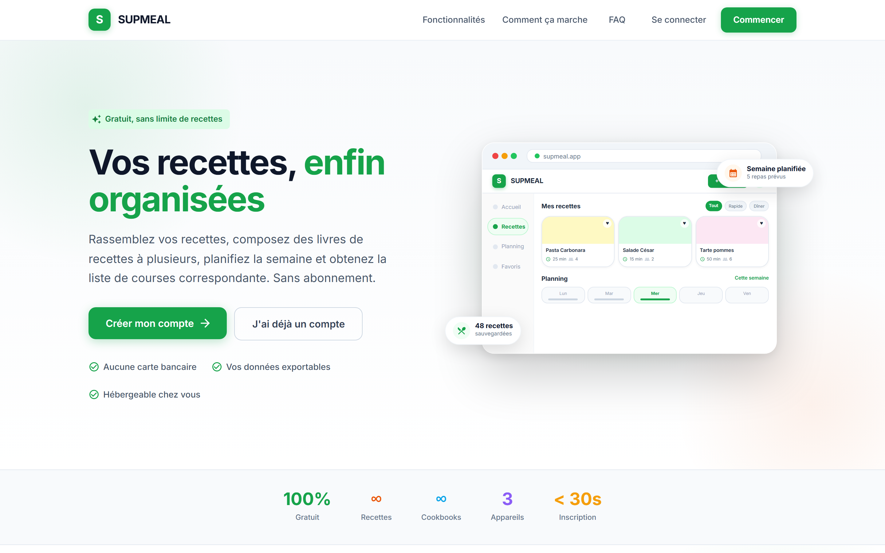

SUPMEAL est une application web de gestion de recettes et de planification de repas. Elle permet de créer, organiser et partager des recettes au sein de cookbooks collaboratifs.

---

## 1. Inscription et connexion

### Créer un compte

1. Accédez à l'application → cliquez sur **"S'inscrire"**
2. Renseignez votre **email**, un **nom d'utilisateur** (3-30 caractères alphanumériques) et un **mot de passe** (8 caractères minimum)
3. Cliquez sur **"Créer mon compte"**

### Se connecter

- **Avec email/mot de passe** : Saisissez vos identifiants sur la page de connexion
- **Avec un compte tiers** : Cliquez sur **Google**, **GitHub** ou **Microsoft** pour une connexion
  OAuth2 sécurisée. Seuls les fournisseurs configurés sur votre déploiement apparaissent ; si aucun
  ne l'est, la section n'est pas affichée et seule la connexion par mot de passe est proposée.

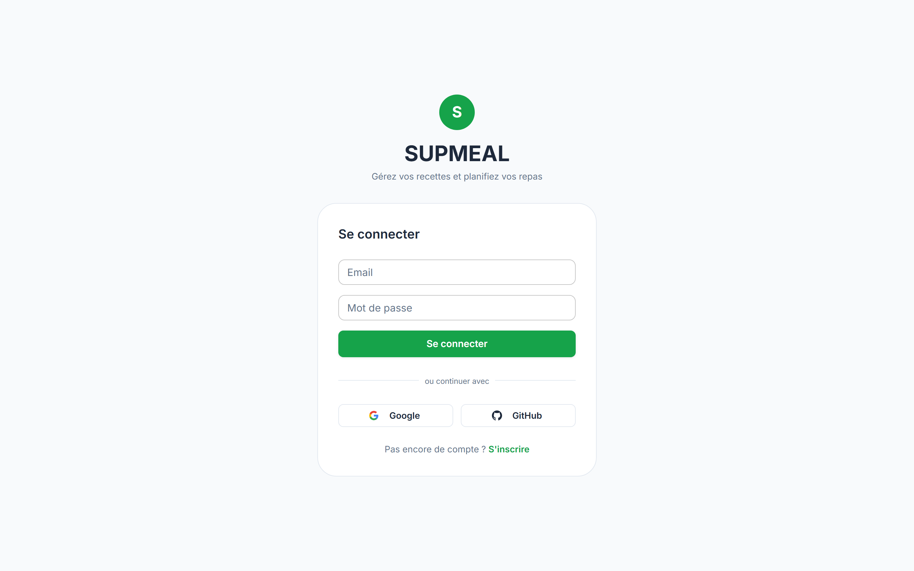

*Seuls les fournisseurs configurés sur le déploiement apparaissent : ici Google et GitHub le sont, Microsoft non.*

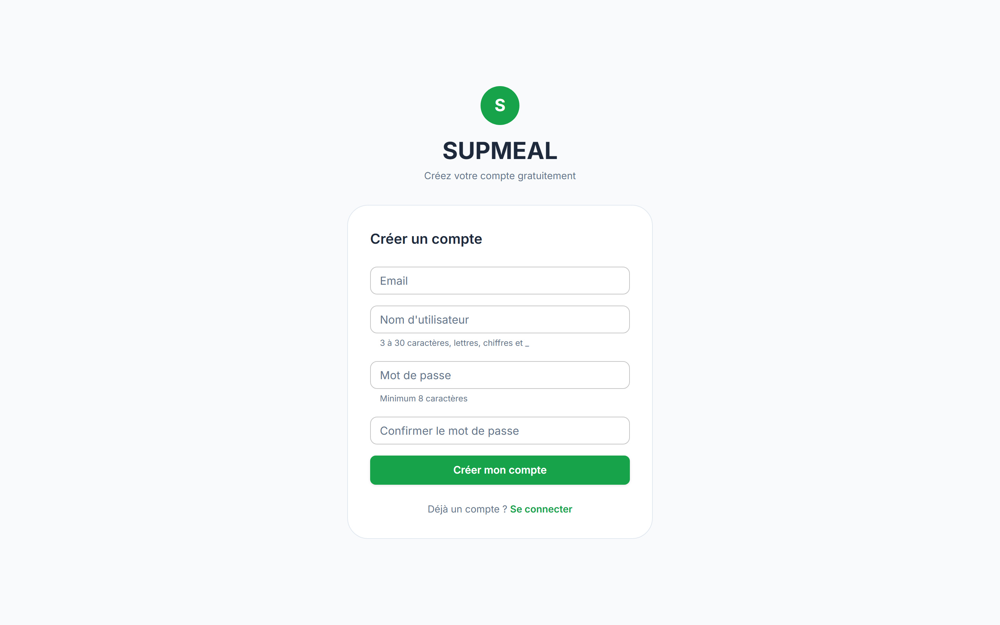

---

## 2. Tableau de bord (Accueil)

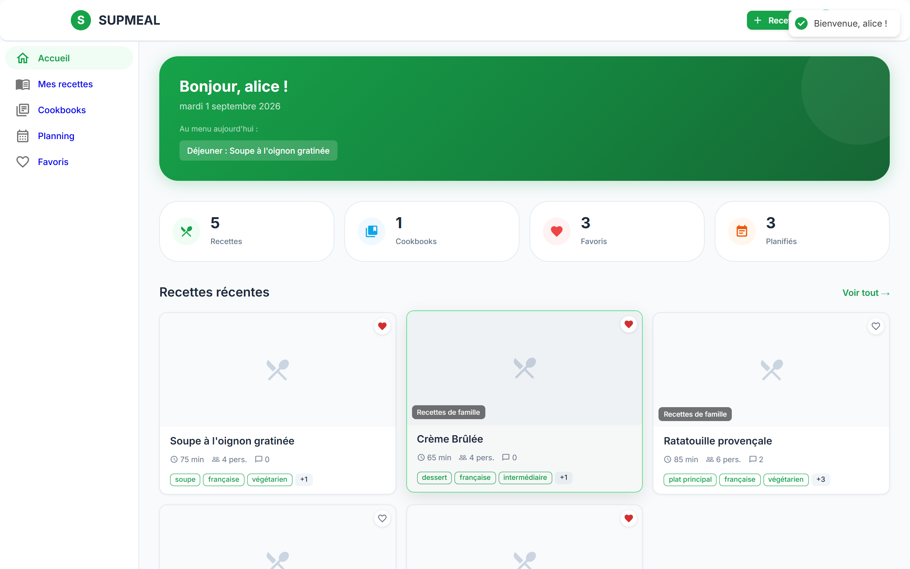

Le tableau de bord affiche :
- Un **message de bienvenue** avec la date du jour
- Le **menu d'aujourd'hui** (si un planning existe pour cette semaine)
- Des **statistiques** : nombre de recettes, cookbooks, repas planifiés
- Vos **recettes récentes**
- Vos **cookbooks**

---

## 3. Gestion des recettes

### Créer une recette

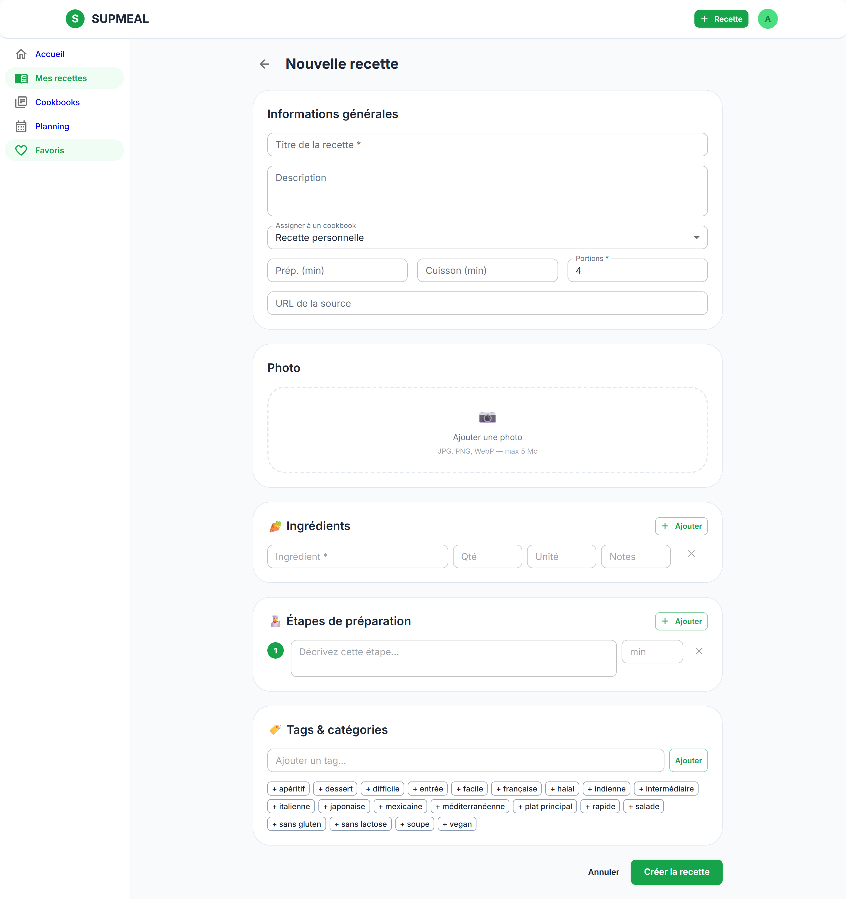

1. Cliquez sur **"+ Nouvelle recette"** (barre de navigation ou page Recettes)
2. Remplissez les champs :
   - **Titre** (obligatoire)
   - **Description** (optionnelle)
   - **Cookbook** : laissez vide pour une recette personnelle, ou choisissez un cookbook
   - **Temps de préparation** et **temps de cuisson** (en minutes)
   - **Nombre de portions**
   - **URL source** (si la recette vient d'ailleurs)
3. Ajoutez une **photo** (JPG, PNG, WebP — max 5 Mo)
4. Ajoutez les **ingrédients** : nom, quantité, unité, notes
5. Rédigez les **étapes** dans l'ordre
6. Ajoutez des **tags** (catégorie, régime, difficulté, cuisine)
7. Cliquez sur **"Créer la recette"**

### Modifier une recette

Sur la page de détail d'une recette dont vous êtes l'auteur, cliquez sur **"✏️ Modifier"**.

### Mettre en favoris

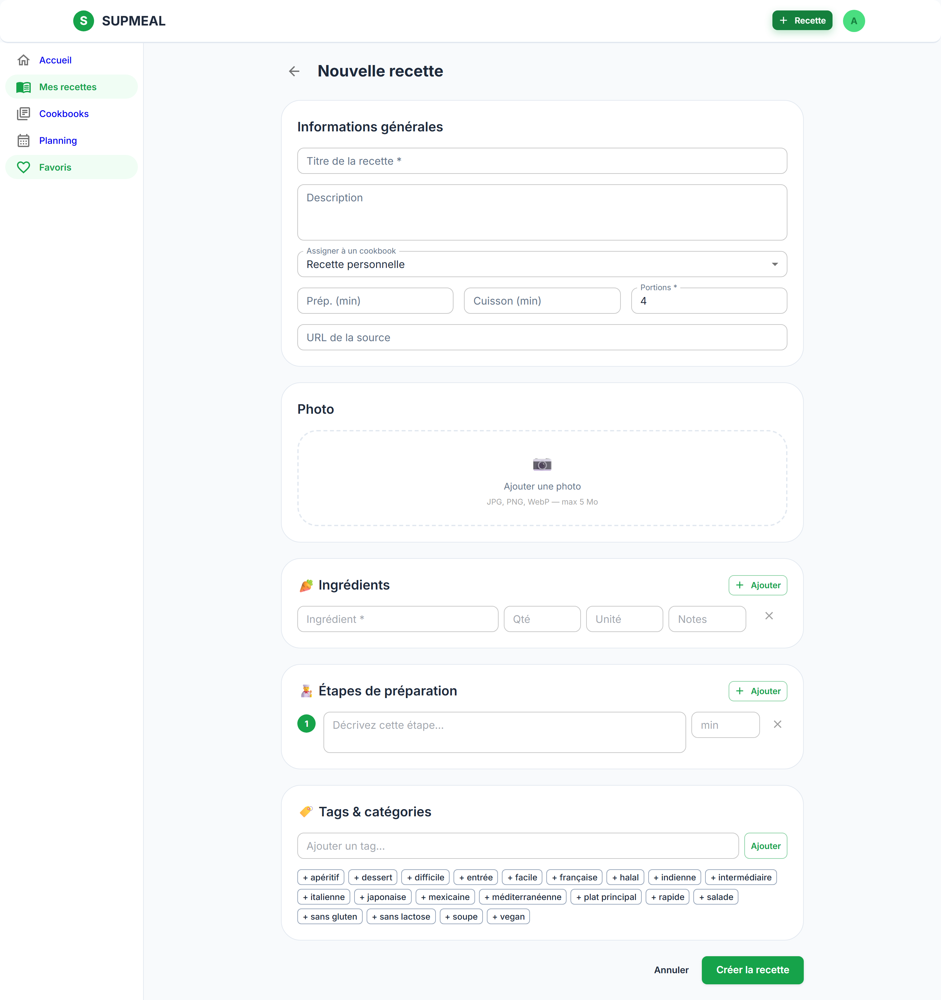

Cliquez sur l'icône ❤️ sur la carte ou la page de détail d'une recette.

### Planifier un repas

Sur la page de détail, cliquez sur **"📅 Planifier"** pour ajouter la recette à un planning.

### Commenter une recette

Les recettes appartenant à un cookbook partagé peuvent être commentées. Saisissez votre commentaire en bas de la page de détail.

---

## 4. Recherche et filtrage

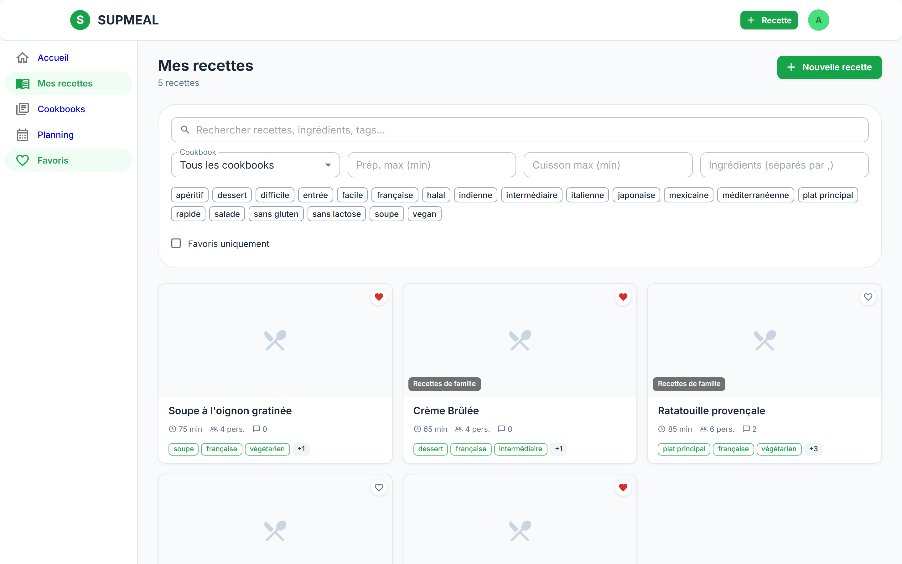

La recherche ignore les accents et la casse : « creme » retrouve « Crème Brûlée ».

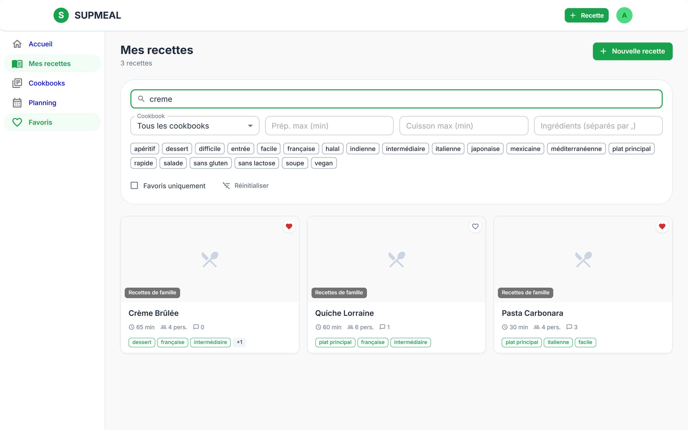

La page **"Mes recettes"** propose des filtres puissants :

| Filtre | Description |
|---|---|
| **Recherche plein texte** | Titre, ingrédients, tags, description |
| **Cookbook** | Filtrer par cookbook ou recettes personnelles |
| **Temps de préparation** | Maximum en minutes |
| **Temps de cuisson** | Maximum en minutes |
| **Ingrédients** | Séparez plusieurs ingrédients par des virgules |
| **Tags** | Cliquez sur les tags pour les activer/désactiver |
| **Favoris** | Cochez pour n'afficher que vos favoris |

---

## 5. Cookbooks partagés

### Créer un cookbook

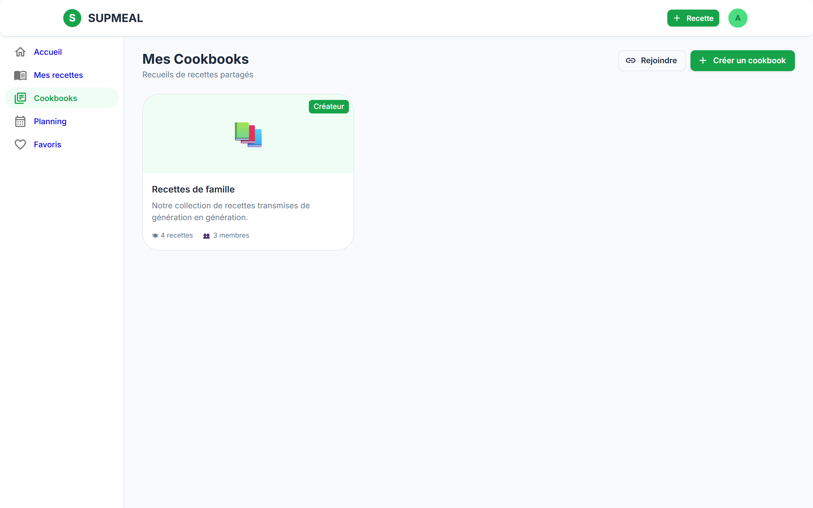

1. Page **"Cookbooks"** → **"+ Créer un cookbook"**
2. Donnez un nom et une description optionnelle
3. Vous êtes automatiquement **Créateur**

### Inviter des membres

1. Ouvrez le cookbook → **"📩 Inviter"**
2. Entrez l'email du membre et choisissez son rôle :
   - **Éditeur** : peut ajouter et modifier des recettes
   - **Commentateur** : peut commenter les recettes et chatter
   - **Lecteur** : lecture seule
3. Copiez le **token** généré et envoyez-le au membre

### Rejoindre un cookbook

1. Page **"Cookbooks"** → **"🔗 Rejoindre"**
2. Collez le token reçu → **"Rejoindre"**

### Onglets d'un cookbook

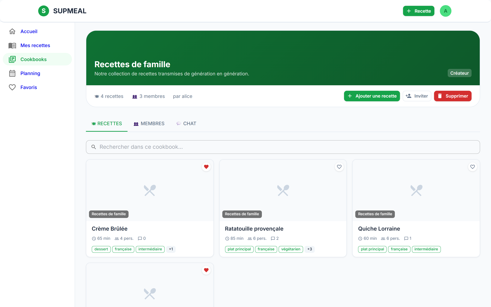

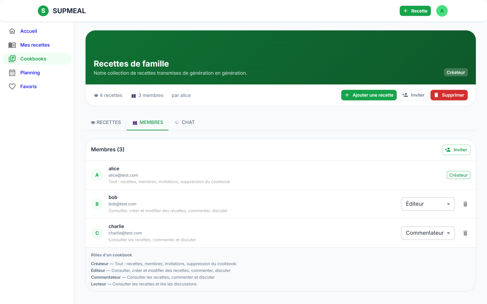

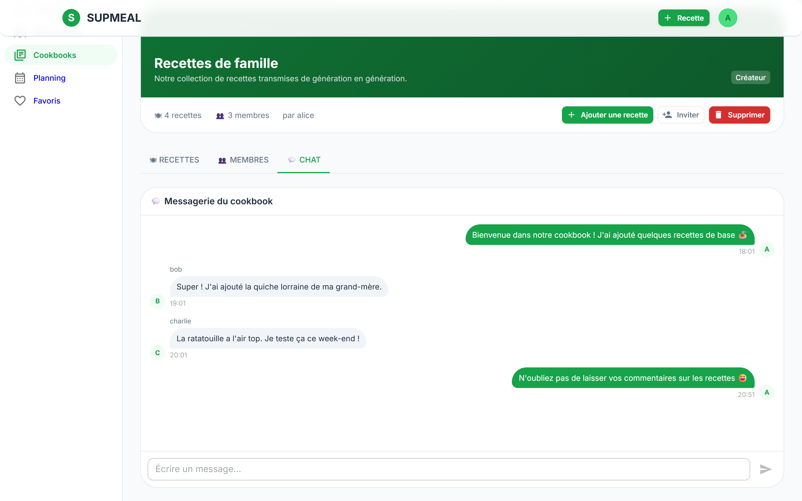

- **🍽 Recettes** : Toutes les recettes du groupe, avec barre de recherche dédiée
- **👥 Membres** : Liste des membres et gestion des rôles (Créateur uniquement)
- **💬 Chat** : Messagerie instantanée du groupe (temps réel)

En haut du salon, un compteur indique **qui est connecté en ce moment** — pastille verte, nombre et
initiales des personnes présentes. Il se met à jour instantanément quand quelqu'un ouvre ou ferme
l'onglet, sans avoir à recharger la page. Survolez une initiale pour lire le nom.

C'est la présence *dans le salon*, non la liste des membres du cookbook : un membre qui n'a pas
ouvert l'onglet Chat n'y figure pas.

---

## 6. Planning de repas

### Planifier à plusieurs

Au moment de créer le planning de la semaine, le menu **« Partager avec un cookbook »** permet de le
rattacher à l'un de vos cookbooks. Le planning devient alors celui du groupe : tous les membres le
voient, et les **Créateurs** comme les **Éditeurs** peuvent y ajouter ou retirer des repas. Les
**Commentateurs** et **Lecteurs** le consultent sans le modifier.

Un bandeau **« Partagé »** rappelle, au-dessus de la grille, à quel cookbook le planning appartient.

Sans sélection, le planning reste personnel et n'est visible que de vous.

### Créer un planning

1. Page **"Planning"** → **"Créer le planning de la semaine"**
2. La semaine en cours est automatiquement sélectionnée

### Suggestions pour un créneau

Quand vous cliquez sur **+** dans une case du planning, SUPMEAL propose d'abord trois recettes
adaptées à ce créneau, chacune accompagnée de la raison pour laquelle elle est proposée :

- **« Proche des recettes que vous aimez »** — d'après vos favoris et ce que vous avez déjà cuisiné
- **« 60 % de ses ingrédients sont déjà prévus cette semaine »** — pour limiter les courses
- **« Tient en 30 min, compatible avec ce créneau »** — un petit-déjeuner de semaine dispose de moins
  de temps qu'un dîner du dimanche
- **« Vous ne l'avez pas cuisinée depuis longtemps »** — pour varier

Les recettes contenant un ingrédient correspondant à une **allergie déclarée** dans vos préférences
ne sont jamais proposées. Celles déjà au planning de la semaine sont écartées ; si toutes le sont,
elles réapparaissent en portant la mention « déjà prévue ».

La recherche manuelle reste disponible juste en dessous.

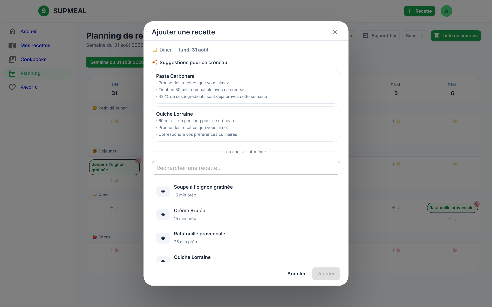

### Ajouter une recette au planning

- Cliquez sur **"+"** dans une case du calendrier (jour × repas)
- Recherchez et sélectionnez une recette
- Confirmez

ou depuis une page de détail de recette : **"📅 Planifier"**

### Générer la liste de courses

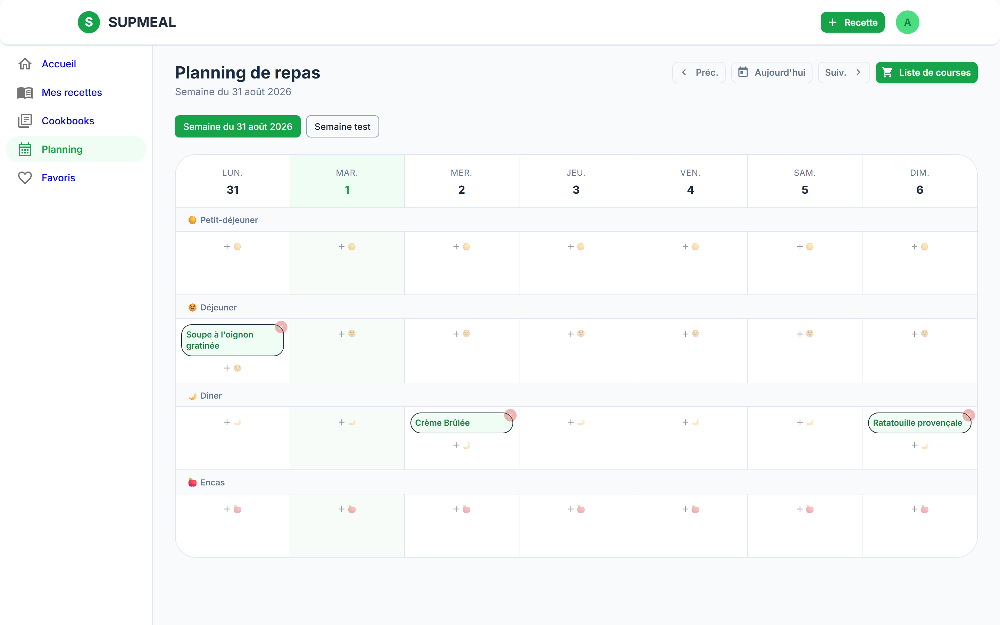

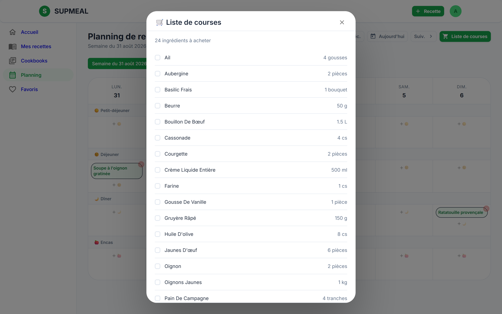

Une fois votre planning créé, cliquez sur **"🛒 Liste de courses"** pour obtenir la liste agrégée de tous les ingrédients de la semaine, avec les quantités totales.

### Naviguer entre les semaines

Utilisez les boutons **← Semaine précédente** et **Semaine suivante →**.

---

## 7. Import / Export

Page accessible via le menu utilisateur → **"Import / Export"**

### Exporter

1. Choisissez le format :
   - **JSON** — export complet et réimportable : recettes, cookbooks et leur contenu
   - **CSV** — tableur ; format à plat, une partie du détail est perdue
   - **Mealie** — liste de recettes importable dans Mealie ; les cookbooks y sont aplatis
2. ⚠️ **Cochez la case d'avertissement.** Le bouton d'export reste inactif tant que vous ne l'avez
   pas fait : le fichier produit contient toutes vos données **en clair**, sans chiffrement.
3. Cliquez sur **« Exporter »** pour télécharger le fichier

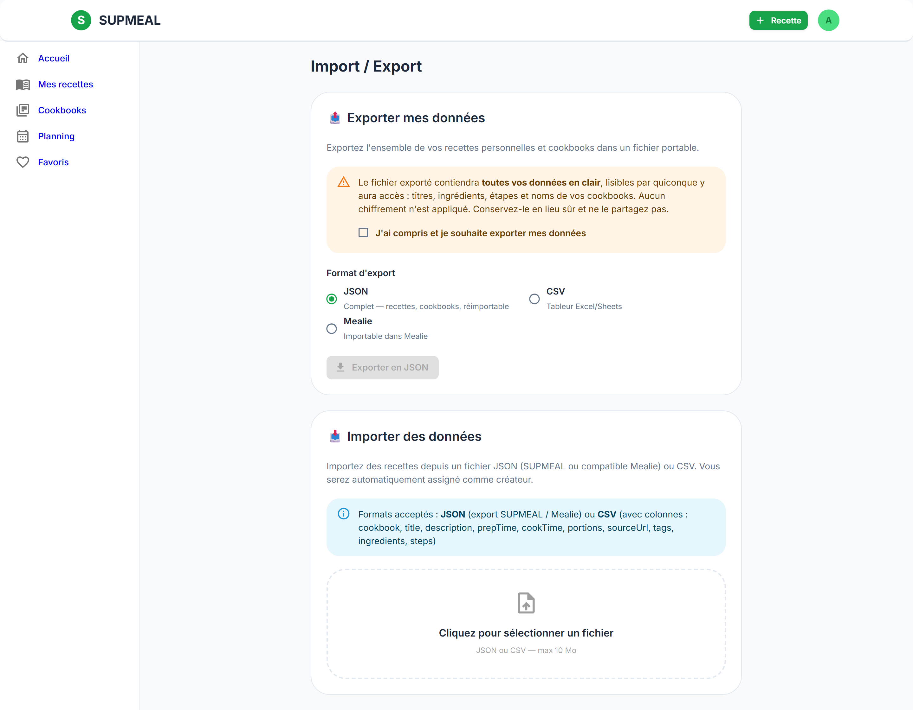

*Le bouton d'export reste inactif tant que l'avertissement n'est pas coché.*

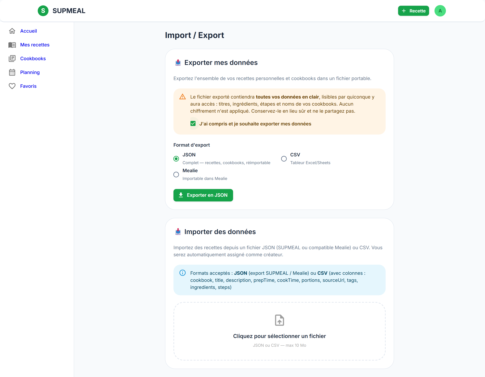

### Importer

1. Cliquez sur la zone d'import et sélectionnez un fichier **.json** ou **.csv**
2. Confirmez l'avertissement
3. Le rapport d'import affiche le nombre de recettes et cookbooks créés, ainsi que les éventuelles erreurs

**Formats acceptés** — le format est reconnu automatiquement :
- JSON SUPMEAL (export de cette application)
- JSON Mealie ou schema.org/Recipe : une recette seule, un tableau de recettes, ou un objet les
  regroupant. Les durées ISO 8601 (`PT1H30M`), les portions en texte libre (« 4 servings ») et les
  ingrédients sous forme d'objets ou de chaînes sont interprétés.
- CSV avec colonnes : `cookbook, title, description, prepTime, cookTime, portions, sourceUrl, tags, ingredients, steps`

---

## 8. Paramètres

Page accessible via le menu utilisateur → **"Paramètres"**

### Profil

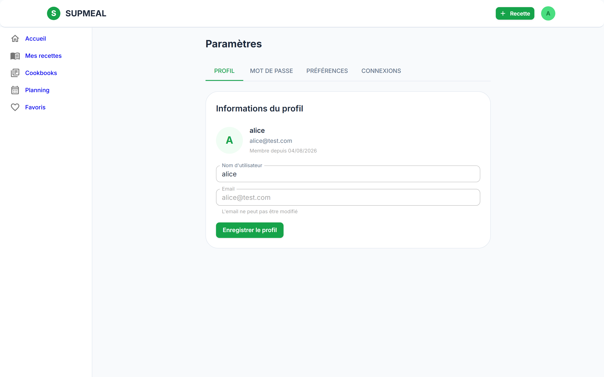

Modifiez votre nom d'utilisateur.

### Mot de passe

Changez votre mot de passe en renseignant l'ancien puis le nouveau.

### Préférences culinaires

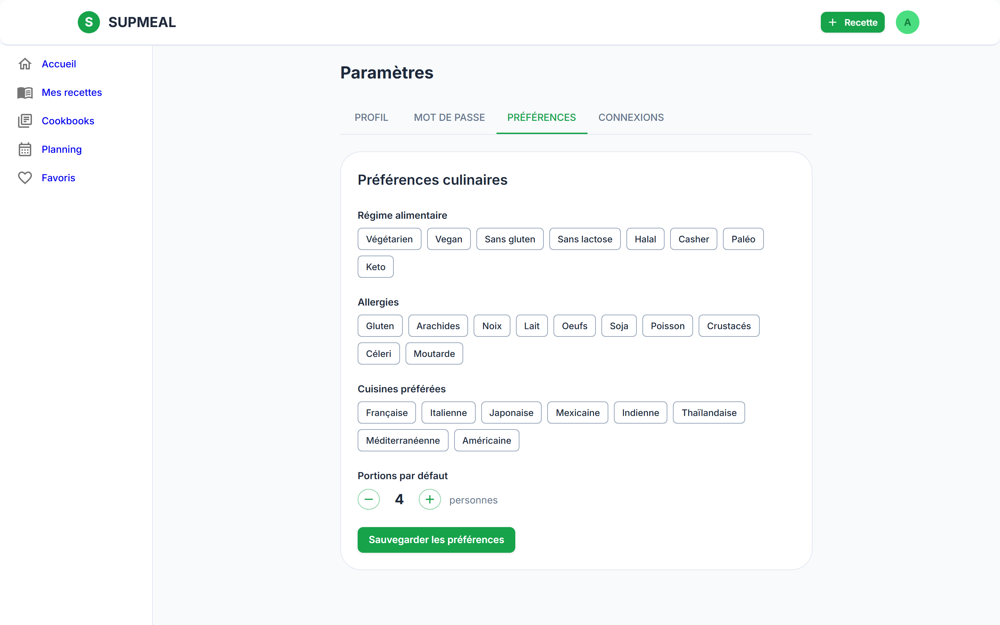

Définissez vos préférences pour personnaliser l'expérience :
- **Régime alimentaire** : végétarien, vegan, sans gluten, etc.
- **Allergies** : gluten, arachides, lactose, etc.
- **Cuisines préférées** : française, italienne, japonaise, etc.
- **Portions par défaut** : pré-remplit le champ Portions de toute nouvelle recette

Les **allergies** déclarées sont confrontées aux ingrédients : un bandeau d'avertissement apparaît
sur la fiche d'une recette qui en contient. Il s'agit d'un signalement, la recette reste consultable.
Le régime alimentaire et les cuisines préférées sont pour l'instant purement déclaratifs.

### Comptes liés (OAuth2)

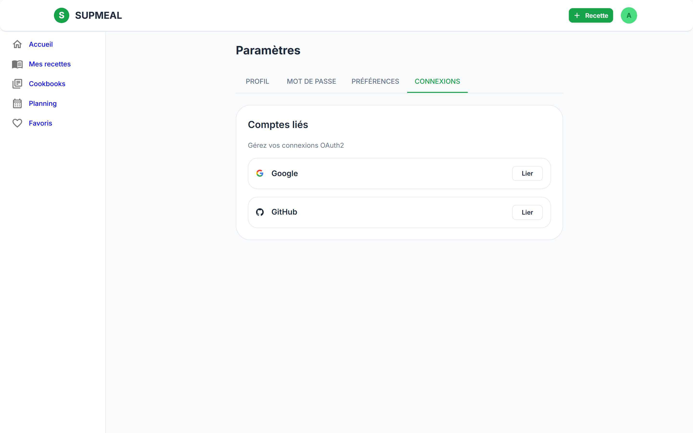

Associez ou dissociez des comptes Google, GitHub ou Microsoft à votre profil.

---

## 9. Bon à savoir

### Rôles dans un cookbook

| Rôle | Consulter | Commenter et chatter | Créer et modifier des recettes | Gérer les membres |
|---|:---:|:---:|:---:|:---:|
| **Créateur** | ✔ | ✔ | ✔ | ✔ |
| **Éditeur** | ✔ | ✔ | ✔ | — |
| **Commentateur** | ✔ | ✔ | — | — |
| **Lecteur** | ✔ | — | — | — |

L'onglet **Membres** d'un cookbook indique, sous le nom de chaque personne, ce que son rôle
l'autorise à faire, et rappelle les quatre rôles en pied de liste.

Seul le créateur peut inviter, changer un rôle ou supprimer le cookbook. Il ne peut pas quitter son
propre cookbook : il doit le supprimer.

### Quitter un cookbook

En quittant un cookbook, vous perdez l'accès à **toutes** ses recettes, y compris celles que vous y
avez ajoutées : elles restent au cookbook et à ses membres.

### Origine d'une recette

La fiche indique toujours d'où vient la recette : un lien vers la **source** si vous en avez fourni
une à la création, la mention **« Création personnelle »** dans le cas contraire.

### Recherche

La recherche ignore les accents et la casse : « creme » trouve « Crème brûlée ». Elle porte sur le
titre, la description, **les étapes**, les ingrédients et les tags.

### Page introuvable

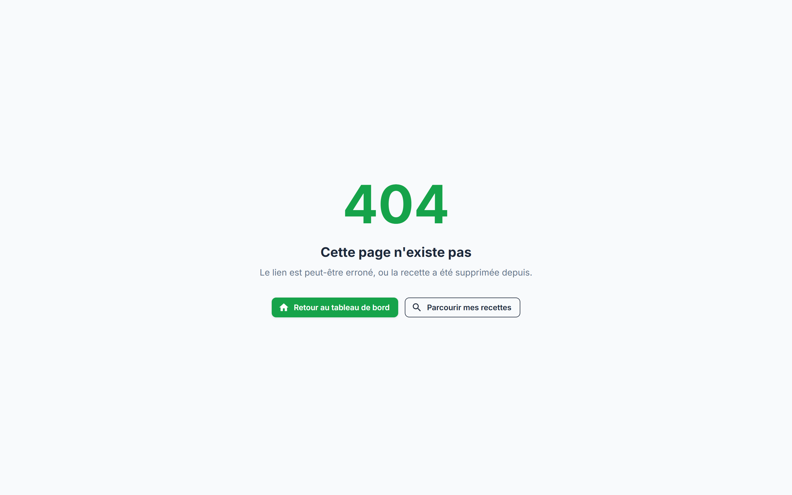

Une adresse inconnue affiche une page 404 proposant un retour au tableau de bord ou à vos recettes.

### Sur téléphone

L'interface s'adapte aux petits écrans : la navigation passe en barre inférieure et la grille du
planning défile horizontalement au lieu d'être rognée.

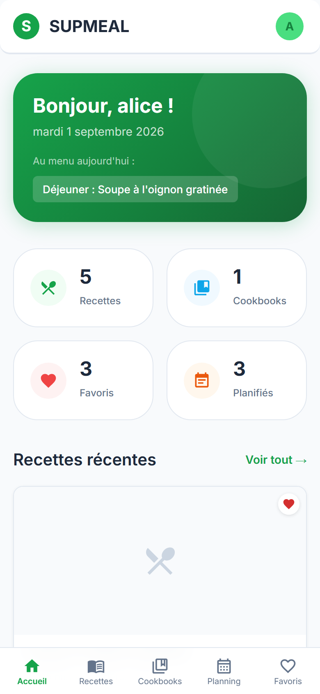

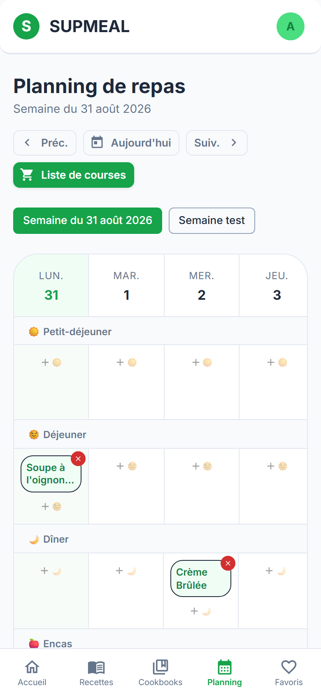
